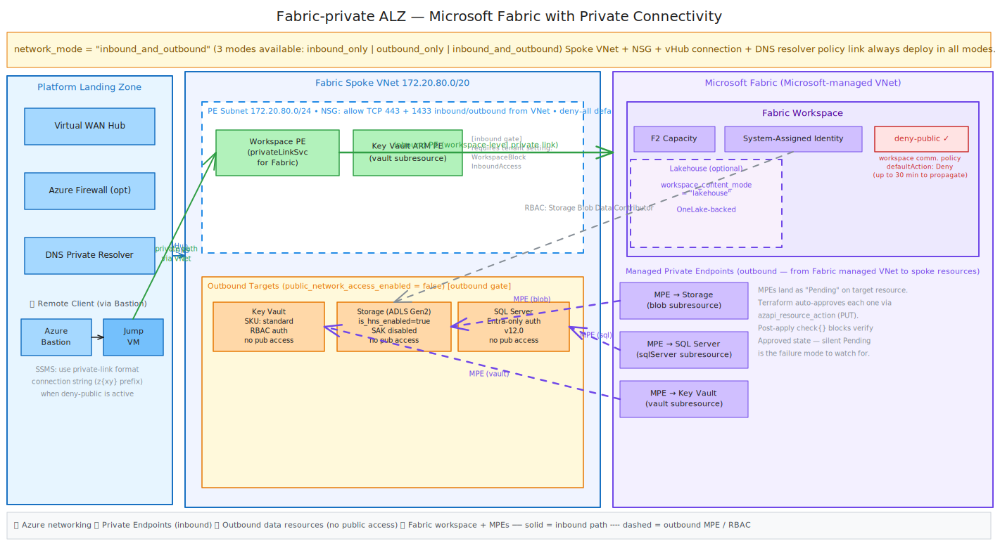

# Application Landing Zone — Microsoft Fabric (Fabric-private)

This is an optional application landing zone. It deploys a Microsoft Fabric capacity and workspace with three private connectivity options via the `network_mode` variable: inbound-only (workspace private endpoint), outbound-only (managed private endpoints to Azure data sources), or both. The spoke VNet and platform connectivity always deploy.

The module creates the VNet, subnets, and hub connection. You do not need to deploy this to use the Networking module on its own.

## Architecture



_Source: [fabric-alz.excalidraw](../Diagrams/fabric-alz.excalidraw) — open in [Excalidraw](https://excalidraw.com) to edit._

This diagram shows the `inbound_and_outbound` configuration:

1. **Platform LZ**: Virtual WAN Hub, Azure Firewall (optional), DNS Private Resolver, Azure Bastion + Jump VM
2. **Fabric Spoke VNet**: Hosts the workspace private endpoint and Key Vault endpoint. Data targets (Key Vault, Storage ADLS Gen2, SQL Server) are in the same VNet with `public_network_access_enabled = false`.
3. **Microsoft Fabric (managed VNet)**: Workspace with F2 Capacity, System-Assigned Identity, optional Lakehouse, and 3 managed private endpoints to spoke resources.

Inbound (solid green): Remote client → Bastion → Jump VM → Workspace PE → Fabric Workspace (deny-public policy active).

Outbound (dashed purple): Fabric Workspace → MPE → Storage / SQL / Key Vault.

## What It Deploys

Resources marked **[inbound]** require `network_mode` to include `inbound` (i.e., `inbound_only` or `inbound_and_outbound`).
Resources marked **[outbound]** require `network_mode` to include `outbound` (i.e., `outbound_only` or `inbound_and_outbound`).
Unmarked resources always deploy.

| Resource                    | Mode       | Purpose                                                                           |
| --------------------------- | ---------- | --------------------------------------------------------------------------------- |
| Fabric Capacity (F2)        | Always     | Compute capacity for the workspace                                                |
| Fabric Workspace            | Always     | Container for Fabric items (System-Assigned identity always provisioned)          |
| Fabric Lakehouse            | Opt-in     | OneLake-backed Lakehouse (`workspace_content_mode = "lakehouse"`)                 |
| Workspace PE                | [inbound]  | Private inbound path to the workspace                                             |
| Communication policy        | [inbound]  | Deny-public-access policy on the workspace                                        |
| Lab Storage Account (ADLS Gen 2) | [outbound] | Blob storage target for Fabric MPE; hierarchical namespace enabled           |
| Lab Azure SQL Server + DB   | [outbound] | SQL target for Fabric MPE                                                         |
| Workspace-Local Key Vault   | [outbound] | Secrets storage for the Fabric workspace (reached via MPE)                        |
| Storage Blob Data Contributor RBAC | [outbound] | Workspace identity → lab storage account                                  |
| 3 Managed Private Endpoints | [outbound] | Outbound private paths from Fabric to Storage (blob), SQL, and workspace-local KV |
| Spoke VNet (Block 5)        | Always     | `172.20.80.0/20` with PE subnet                                                   |
| NSG                         | Always     | Explicit allow rules on PE subnet (443, 1433)                                     |
| vHub connection             | Always     | Connects spoke to platform Virtual WAN hub                                        |
| DNS resolver policy link    | Always     | Private DNS resolution via platform DNS                                           |

## Prerequisites

- All [platform landing zone prerequisites](../README.md#prerequisites)
- Platform Landing Zone (`Networking/`) applied first with `add_private_dns00 = true`
- **One-time tenant configuration** — complete the gate sequence below before first deploy

### Tenant Configuration Gates (One-Time)

Fabric Admin Portal and tenant-settings REST API are only accessible after two gates. Follow this sequence:

#### Gate 1: Entra Directory Role

Azure RBAC roles (Subscription Owner, Contributor, etc.) grant **zero** Fabric admin authority. You must hold one of these Microsoft Entra directory roles:

- **Global Administrator**, OR
- **Power Platform Administrator**, OR
- **Fabric Administrator** (formerly Power BI Administrator)

Have an Entra admin assign you one of these roles in the [Entra admin center](https://entra.microsoft.com) (Roles and administrators → search for the role). Allow 5–15 minutes for the role to propagate after assignment.

#### Gate 2: Fabric Tenant Provisioning

Even with the Entra role, the Fabric Admin Portal and tenant-settings API return nothing until Fabric is provisioned on your tenant. Choose one:

- **Fastest:** Sign up for [Microsoft Fabric Free](https://app.fabric.microsoft.com) — click "Start trial" or the free tier signup button
- **Trial:** Start a Fabric Trial
- **Capacity:** Have an F-SKU capacity provisioned

After provisioning, verify access: navigate to [https://app.fabric.microsoft.com/admin-portal](https://app.fabric.microsoft.com/admin-portal). If you see the admin portal, both gates are open.

#### Gate 3: Enable Tenant Settings

Now that you have the Entra role and Fabric is provisioned, enable these tenant settings:

1. **Users can create Fabric items** (`FabricGAWorkloads`) — the "Microsoft Fabric" admin switch. Enable for the tenant or a security group. *(Note: "Microsoft Fabric" is a section header in the admin portal, not a separate API setting — this single toggle controls it.)*
2. **Configure workspace-level inbound network rules** (`WorkspaceBlockInboundAccess`) — enables workspace admins to restrict inbound public access (required for workspace-level private endpoints). Re-register `Microsoft.Fabric` provider afterward.
3. **Service principals can call Fabric public APIs** (`ServicePrincipalAccessGlobalAPIs`) — enable if running Terraform as a service principal.

Run the helper script to automate this:

```powershell
./configure-fabric-tenant-settings.ps1
```

Or configure manually via the Fabric Admin Portal (Admin portal → Tenant settings).

After toggling workspace-level inbound network rules, re-register the Fabric provider:

```sh
az provider register --namespace Microsoft.Fabric
```

## Quick Start

```sh
cd Fabric-private
cp terraform.tfvars.example terraform.tfvars   # edit if needed
terraform init
terraform plan
terraform apply
```

## Variables

| Variable                           | Default              | Purpose                                                           |
| ---------------------------------- | -------------------- | ----------------------------------------------------------------- |
| `resource_group_name`              | `"rg-fabric00"`      | Resource group name prefix                                        |
| `fabric_vnet_address_space`        | `["172.20.80.0/20"]` | VNet address range (Block 5)                                      |
| `pe_subnet_address`                | `["172.20.80.0/24"]` | PE subnet CIDR                                                    |
| `fabric_capacity_sku`              | `"F2"`               | Fabric capacity SKU                                               |
| `capacity_admin_upn_list`          | `[]`                 | UPNs for capacity admins (or use group OID)                       |
| `capacity_admin_group_object_id`   | `null`               | Entra group OID for capacity admins (recommended for shared labs) |
| `network_mode`                     | `"inbound_only"`     | Connectivity mode — see [Network Mode](#network-mode) below       |
| `workspace_content_mode`           | `"none"`             | `"none"` = empty workspace; `"lakehouse"` = deploy a Fabric Lakehouse (opt-in) |

For shared lab deployments, set `capacity_admin_group_object_id` to a security group containing all operators. The zero-config default uses the current `az` signed-in user.

## Network Mode

The `network_mode` variable controls which private connectivity paths are deployed. The spoke VNet, subnets, NSG, vHub connection, and DNS always deploy in all modes.

### `inbound_only` (default)

Deploys the workspace private endpoint and denies public access. The workspace is accessible only via the PE (Bastion, VPN, or ExpressRoute). No managed private endpoints or data targets are deployed.

Use this when the Fabric tenant setting "Configure workspace-level inbound network rules" is enabled, and you want to restrict inbound access to the workspace.

### `outbound_only`

Deploys managed private endpoints from the Fabric workspace to Storage, SQL, and Key Vault, along with those resources. The workspace remains publicly accessible (no workspace PE or deny-public-access policy). The workspace System-Assigned identity gets Storage Blob Data Contributor on the storage account.

Use this when the Fabric tenant setting "Configure workspace-level inbound network rules" is not enabled, or when you want private data-plane connectivity to Azure resources but accept public workspace access. This pattern works for organizations exploring Fabric's outbound networking without inbound lockdown.

### `inbound_and_outbound`

Both the workspace private endpoint (inbound) and managed private endpoints to data targets (outbound) are deployed. This gives full private connectivity.

## Workspace Identity

The Fabric workspace has a System-Assigned managed identity (always provisioned). Its service principal object ID is exported as `workspace_identity_service_principal_id`.

In `outbound_only` and `inbound_and_outbound` modes, the workspace gets `Storage Blob Data Contributor` on the storage account for data access via managed private endpoints. A 60-second delay prevents Entra ID propagation issues.

## Workspace Content

The `workspace_content_mode` variable controls optional Fabric items:

- `"none"` (default) — empty workspace
- `"lakehouse"` — deploys a OneLake-backed Lakehouse named `Lakehouse_{suffix}`

## Outputs

| Output                                    | Mode       | Purpose                                          |
| ----------------------------------------- | ---------- | ------------------------------------------------ |
| `resource_group_id`                       | Always     | Resource group ID                                |
| `fabric_capacity_id`                      | Always     | Fabric capacity ID                               |
| `fabric_workspace_id`                     | Always     | Fabric workspace ID                              |
| `workspace_identity_application_id`       | Always     | Workspace identity Entra application ID          |
| `workspace_identity_service_principal_id` | Always     | Workspace identity service principal object ID   |
| `storage_account_id`                      | [outbound] | Lab storage account ID (null otherwise)          |
| `sql_server_id`                           | [outbound] | Lab SQL server ID (null otherwise)               |
| `sql_database_id`                         | [outbound] | Lab SQL database ID (null otherwise)             |
| `key_vault_id`                            | [outbound] | Workspace-local Key Vault ID (null otherwise)    |
| `mpe_storage_id`                          | [outbound] | Storage blob MPE ID (null otherwise)             |
| `mpe_sql_id`                              | [outbound] | SQL Server MPE ID (null otherwise)               |
| `mpe_keyvault_id`                         | [outbound] | Key Vault MPE ID (null otherwise)                |
| `workspace_private_link_service_id`       | [inbound]  | Fabric private link service ARM ID (null otherwise) |
| `workspace_private_endpoint_id`           | [inbound]  | Fabric workspace private endpoint ID (null otherwise) |
| `workspace_private_endpoint_ip`           | [inbound]  | Private IP assigned to the workspace PE (null otherwise) |
| `lakehouse_sql_connection_string`         | [lakehouse] | SQL endpoint connection string (public format; null if no lakehouse) |
| `lakehouse_sql_connection_string_private_link` | [lakehouse] | SQL endpoint connection string in z{xy} private link format — use this in SSMS with inbound mode (null if no lakehouse) |

## Security Posture

### Workspace Identity

The workspace has a System-Assigned managed identity. In `outbound_only` and `inbound_and_outbound` modes, it gets `Storage Blob Data Contributor` on the storage account for data access via managed private endpoints (no shared keys).

### Private Connectivity

Connectivity depends on `network_mode`:

- **Inbound (`inbound_only`, `inbound_and_outbound`):** The workspace private endpoint in the spoke VNet allows private connections only. The workspace denies public access — users must connect via the PE (Bastion, VPN, or ExpressRoute).
- **Outbound (`outbound_only`, `inbound_and_outbound`):** The workspace reaches Storage, SQL, and Key Vault via 3 managed private endpoints. The workspace-local Key Vault is in the Fabric resource group and accessed via its endpoint.

The spoke VNet and platform connectivity always deploy. In `outbound_only` mode, the PE subnet exists but is empty — this maintains consistency across landing zones.

### Private-Only Access (inbound modes)

When `network_mode` includes inbound, the workspace blocks public internet access. The Fabric portal (`app.fabric.microsoft.com`) loads over the public internet, but workspace API calls are blocked unless the caller is on a network with the private endpoint.

> **⏱ Propagation delay:** After `terraform apply`, the deny-public policy can take **up to 30 minutes** to take full effect per [Microsoft docs](https://learn.microsoft.com/en-us/fabric/security/security-workspace-level-private-links-set-up). The workspace may briefly remain reachable from the internet after apply — this is expected.

### Connecting via SSMS (inbound modes)

When the workspace denies public access, SSMS must use the private link format of the SQL connection string. SSMS makes a control-plane API call (`FabricWorkspaceApi.GetAsync`) before it opens the SQL connection. With a regular connection string, SSMS calls `api.fabric.microsoft.com` (public) and gets blocked. With the private link format (z{xy} prefix), SSMS routes through the workspace-specific FQDN (`{workspaceid}.z{xy}.w.api.fabric.microsoft.com`), which resolves to the PE private IP via the private DNS zone.

**Step 1 — Get the private link connection string:**

```sh
terraform output lakehouse_sql_connection_string_private_link
```

Or read the `lakehouse_sql_connection_string` output and insert `.z{xy}.` before `.datawarehouse.` (where `{xy}` = the first two characters of the workspace GUID without dashes — from `terraform output fabric_workspace_id`).

The resulting SQL endpoint FQDN will look like:
- **Before (public):** `{GUID}-{GUID}.datawarehouse.fabric.microsoft.com`
- **After (private link):** `{GUID}-{GUID}.z{xy}.datawarehouse.fabric.microsoft.com` ← This goes into SSMS

**Step 2 — Connect in SSMS:**

| Field | Value |
|---|---|
| Server name | `{output from step 1}` (the `.z{xy}.datawarehouse.` FQDN) |
| Authentication | Microsoft Entra — MFA, or Password |
| Port | 1433 (default) |

The VM must be on the network connected via the workspace PE (Bastion session works). DNS on the VM must resolve workspace-specific FQDNs to the PE private IP (verified by `nslookup {workspaceid-no-dashes}.z{xy}.w.api.fabric.microsoft.com` returning `172.20.80.5`).

### Tenant-Level Private Link — Out of Scope

Tenant-level private link (`BlockPublicNetworkAccess`) is not configured here. That is a tenant-admin setting with broader implications. See [Private links for Fabric tenants](https://learn.microsoft.com/fabric/security/security-private-links-overview) for details. Workspace-level private mode is sufficient for lab isolation.

## Destroy Procedure

### Step 1: Destroy the module

```sh
cd Fabric-private
terraform destroy
```

### Step 2: Capacity and workspace cleanup

- Do NOT pause the capacity before destroy — destroy from `Active` state. If already paused, resume first: `az fabric capacity resume --resource-group <rg> --capacity-name <name>`
- Workspaces enter soft-delete for ~90 days. Random suffix prevents name collisions on re-deploy.
- SQL server names are reserved for ~7 days post-delete. Random suffix mitigates collisions.
- The workspace-local Key Vault has soft-delete enabled with **7-day retention** and purge protection disabled. Re-deploy unblocked. If a same-named KV exists in soft-deleted state, purge it first: `az keyvault purge --name <kv-name>`

### Important

Do NOT toggle the "Configure workspace-level inbound network rules" tenant setting during a deploy lifecycle. If toggled, re-register `Microsoft.Fabric` afterward.
