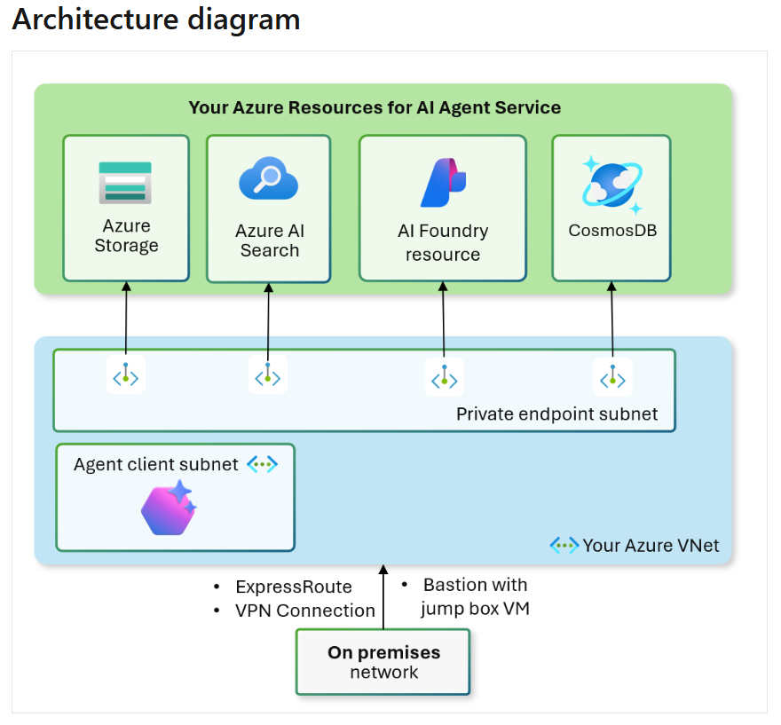

# Private (BYO VNet) Foundry with AI Agent Service (optional)

The Terraform deployment in the Foundry-byoVnet folder will deploy Foundry with AI Agent Service and private endpoints. I modified the sample template below to be dependent on the Networking Foundation template. Apply the Networking Foundation folder first and then apply this folder to complete the build. Foundry, and required resources, will be deployed in your primary region only. Ensure you select a region that supports AI Foundry and where you have quota.

- Foundry TF example with AI Agent Service - https://github.com/azure-ai-foundry/foundry-samples/tree/main/infrastructure/infrastructure-setup-terraform/15b-private-network-standard-agent-setup-byovnet
- "Secure" - I'm using this to highlight the usage of private endpoints. This environment still allows the use of API keys. You can change disableLocalAuth to True to only allow Entra auth.

The template above follows the documented architecture (below) for deploying AI Foundry Standard Setup with private networking (BYO VNet).

- AI Foundry Standard Setup with private networking - https://learn.microsoft.com/en-us/azure/ai-foundry/agents/how-to/virtual-networks



## Cleanup step

### Purge AI Foundry deleted item

After you run terraform destroy you'll still have Foundry in a soft delete state. You need to purge this first before you can run terraform destroy on the network foundation. The Foundry resource will retain the 'serviceassociationlink' to the AI subnet. This is documented below. Around 10+ minutes you should be able to destroy the network foundation.

- Purge a deleted resource - https://learn.microsoft.com/en-us/azure/ai-services/recover-purge-resources?tabs=azure-cli#purge-a-deleted-resource

### Ghost or stale resources

You may run into nested resource errors when attempting to destroy the environment. If you've already deleted the resource with CLI/Portal and the error persists you can try a REST call. Here is an example (update SubId and RG):

```
az rest --method delete --url "https://management.azure.com/subscriptions/INSERT-SUB-ID/resourceGroups/rg-net00-eus2-####/providers/Microsoft.Network/dnsResolvers/resolver00-eus2/outboundEndpoints/resolver00-outbound00-eus2?api-version=2022-07-01"
```

## Troubleshooting

I've run into a couple quota related issues during model deployments. This may help if you run into errors.

- "The subscription does not have QuotaId/Feature required by SKU 'S0' from kind 'OpenAI' or contains blocked QuotaId/Feature."
  - Double check that you're using a supported region and have quota. You can check the region availability table in the doc below. You can also check your quota in your AI Foundry Management Center.
  - Region availability table - https://learn.microsoft.com/en-us/azure/ai-foundry/openai/concepts/models?tabs=global-standard%2Cstandard-chat-completions#model-summary-table-and-region-availability
- InsufficientQuota error "This operation require 10 new capacity in quota Tokens Per Minute (thousands) - gpt-4o, which is bigger than the current available capacity 0. The current quota usage is 30 and the quota limit is 30 for quota Tokens Per Minute (thousands) - gpt-4o."
  - You have quota but it's completely consumed by your other deployments. Delete another deployment or reduce the capacity you've assigned to it.
