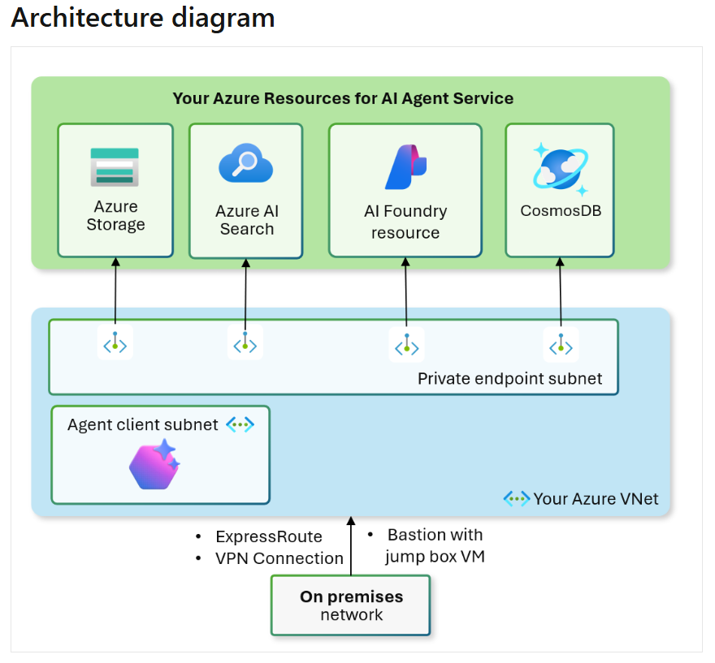

# Application Landing Zone — AI Foundry (BYO VNet)

This is an optional application landing zone. It deploys AI Foundry with AI Agent Service and private endpoints into its own spoke VNet. The module creates the VNet, subnets, and hub connection. You do not need to deploy this to use the Networking module on its own.

This module is based on the [validated Terraform sample](https://github.com/microsoft-foundry/foundry-samples/tree/main/infrastructure/infrastructure-setup-terraform/15b-private-network-standard-agent-setup-byovnet), modified to pull network dependencies from the platform landing zone via `terraform_remote_state`.

"Secure" refers to the use of private endpoints. Local auth (API keys) is disabled on AI Search and Cognitive Services (`disableLocalAuth = true`). All access requires Entra ID authentication.

The template follows the [documented architecture](https://learn.microsoft.com/en-us/azure/ai-foundry/agents/how-to/virtual-networks) for AI Foundry Standard Setup with private networking (BYO VNet).



## Prerequisites

- All [platform landing zone prerequisites](../README.md#prerequisites)
- Platform Landing Zone (`Networking/`) must be applied first
- Private DNS zones must be deployed (`add_private_dns00 = true` in Networking)
- Azure region with AI Foundry support and sufficient quota

Foundry and its required resources deploy in your primary region only.

## Quick Start

Make sure the Networking module is applied with `add_private_dns00 = true` first.

```sh
cd Foundry-byoVnet
terraform init
terraform plan
terraform apply
```

## Variables

| Variable                          | Type           | Default                     | Description                               |
| --------------------------------- | -------------- | --------------------------- | ----------------------------------------- |
| `resource_group_name_ai00`        | `string`       | `"rg-ai00"`                 | Resource Group Name                       |
| `ai_vnet_name`                    | `string`       | `"ai-vnet"`                 | AI spoke VNet name                        |
| `ai_vnet_address_space`           | `list(string)` | `["172.20.32.0/20"]`        | AI spoke VNet address space               |
| `ai_foundry_subnet_name`          | `string`       | `"ai-foundry-subnet"`       | Foundry workload subnet name              |
| `ai_foundry_subnet_address`       | `list(string)` | `["172.20.32.0/26"]`        | Foundry workload subnet address           |
| `private_endpoint_subnet_name`    | `string`       | `"private-endpoint-subnet"` | Private endpoint subnet name              |
| `private_endpoint_subnet_address` | `list(string)` | `["172.20.33.0/24"]`        | Private endpoint subnet address           |
| `connect_to_vhub`                 | `bool`         | `true`                      | Connect AI spoke VNet to platform vHub    |
| `enable_dns_link`                 | `bool`         | `false`                     | Link VNet to platform DNS resolver policy |
| `gpt_model_deployment_name`       | `string`       | `"gpt-5.4"`                 | Name of the GPT model deployment          |
| `gpt_model_name`                  | `string`       | `"gpt-5.4"`                 | GPT model name                            |
| `gpt_model_version`               | `string`       | `"2026-03-05"`              | GPT model version                         |
| `gpt_model_sku_name`              | `string`       | `"GlobalStandard"`          | SKU name for the GPT model deployment     |
| `gpt_model_capacity`              | `number`       | `1`                         | Capacity units for the GPT deployment     |
| `ai_search_sku`                   | `string`       | `"standard"`                | SKU for the AI Search service             |
| `foundry_sku`                     | `string`       | `"S0"`                      | SKU for the AI Foundry account            |

## Outputs

| Output Name             | Description                             |
| ----------------------- | --------------------------------------- |
| `resource_group_id`     | The ID of the AI Foundry resource group |
| `ai_foundry_id`         | The ID of the AI Foundry account        |
| `ai_foundry_project_id` | The ID of the AI Foundry project        |
| `storage_account_id`    | The ID of the Storage Account           |
| `cosmosdb_account_id`   | The ID of the Cosmos DB account         |
| `ai_search_id`          | The ID of the AI Search service         |

## Cleanup Steps

### Purge AI Foundry deleted item

After you run terraform destroy you'll still have Foundry in a soft delete state. You need to purge this first before you can run terraform destroy on the network foundation. The Foundry resource will retain the 'serviceassociationlink' to the AI subnet. This is documented below. Around 10+ minutes you should be able to destroy the network foundation.

- Purge a deleted resource - https://learn.microsoft.com/en-us/azure/ai-services/recover-purge-resources?tabs=azure-cli#purge-a-deleted-resource

## Troubleshooting

I've run into a couple quota related issues during model deployments. This may help if you run into errors.

- "The subscription does not have QuotaId/Feature required by SKU 'S0' from kind 'OpenAI' or contains blocked QuotaId/Feature."
  - Double check that you're using a supported region and have quota. You can check the region availability table in the doc below. You can also check your quota in your AI Foundry Management Center.
  - Region availability table - https://learn.microsoft.com/en-us/azure/ai-foundry/openai/concepts/models?tabs=global-standard%2Cstandard-chat-completions#model-summary-table-and-region-availability
- InsufficientQuota error "This operation require 10 new capacity in quota Tokens Per Minute (thousands) - gpt-4o, which is bigger than the current available capacity 0. The current quota usage is 30 and the quota limit is 30 for quota Tokens Per Minute (thousands) - gpt-4o."
  - You have quota but it's completely consumed by your other deployments. Delete another deployment or reduce the capacity you've assigned to it.
