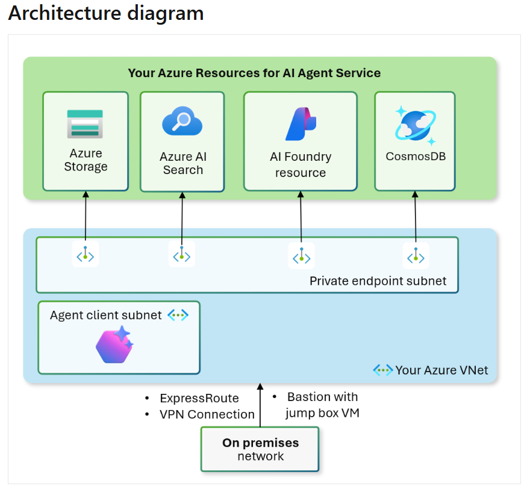

# Application Landing Zone — Microsoft Foundry (BYO VNet)

This is an optional application landing zone. It deploys Microsoft Foundry with Agent Service and private endpoints into its own spoke VNet. The module creates the VNet, subnets, and hub connection. You do not need to deploy this to use the Networking module on its own.

This module is based on the [validated Terraform sample](https://github.com/microsoft-foundry/foundry-samples/tree/main/infrastructure/infrastructure-setup-terraform/15b-private-network-standard-agent-setup-byovnet), modified to pull network dependencies from the platform landing zone via `terraform_remote_state`.

"Secure" refers to the use of private endpoints. Local auth (API keys) is disabled on AI Search and Cosmos DB when the agent data services are deployed. The Foundry account keeps `disableLocalAuth = false`, which the Agent proxy requires for internal communication over a BYO VNet.

The template follows the [documented architecture](https://learn.microsoft.com/en-us/azure/ai-foundry/agents/how-to/virtual-networks) for Microsoft Foundry Standard Setup with private networking (BYO VNet).



## Prerequisites

- All [platform landing zone prerequisites](../README.md#prerequisites)
- Platform Landing Zone (`Networking/`) applied first
- Private DNS zones enabled (`add_private_dns00 = true` in Networking)
- Azure region with AI Foundry support and quota

## Quick Start

```sh
cd Foundry-byoVnet
terraform init && terraform apply
```

**Prerequisites:** Networking module must be applied first with `add_private_dns00 = true`.

## Variables

This module creates its own VNet with subnets and hub connection. Customize networking and deployment names, or use defaults.

| Variable                     | Default              | Purpose                        |
| ---------------------------- | -------------------- | ------------------------------ |
| `resource_group_name_ai00`   | `"rg-ai00"`          | Resource group name            |
| `ai_vnet_address_space`      | `["172.20.32.0/20"]` | VNet address range             |
| `ai_foundry_subnet_address`  | `["172.20.32.0/26"]` | Foundry workload subnet        |
| `deploy_agent_data_services` | `true`               | Deploy BYO agent data services |

### Agent data services

By default the module deploys its own Azure Storage, Cosmos DB, and AI Search, and the project capability host points agent data at them.

Set `deploy_agent_data_services = false` to omit all three, along with their private endpoints, project connections, role assignments, and diagnostic settings. Foundry Agent Service then uses Microsoft-managed storage for conversation history, file uploads, and vector data.

The module remains a bring-your-own virtual network deployment in both modes. The Foundry account, its network injection, the project, the model deployment, and the private endpoint are unchanged.

Capability hosts cannot be updated in place, so pick a value before you deploy. Changing it on a live deployment requires `terraform destroy` first.

For GPT deployment names, SKUs, and other service config, see `variables.tf`.

## Outputs

| Output                  | Purpose                      |
| ----------------------- | ---------------------------- |
| `resource_group_id`     | Resource group ID            |
| `ai_foundry_id`         | Microsoft Foundry account ID |
| `ai_foundry_project_id` | Microsoft Foundry project ID |
| `storage_account_id`    | Storage account ID, null when data services are disabled |
| `cosmosdb_account_id`   | Cosmos DB account ID, null when data services are disabled |
| `ai_search_id`          | AI Search service ID, null when data services are disabled |

## Cleanup

⚠️ **Soft-delete gotcha:** After `terraform destroy`, Foundry enters soft-delete state with a `serviceassociationlink` to the AI subnet. You must purge it before destroying Networking, or the subnet delete will fail. Wait ~10 minutes after purge completes.

- [Purge a deleted resource](https://learn.microsoft.com/en-us/azure/ai-services/recover-purge-resources?tabs=azure-cli#purge-a-deleted-resource)

## Security & Privacy — Foundry Trace Logs

> ⚠️ **PII Risk in Agent Traces**
>
> The Foundry project diagnostic setting captures Trace Logs via the `allLogs` category group. Per [Microsoft's documentation](https://learn.microsoft.com/azure/foundry/observability/how-to/trace-agent-setup#security-and-privacy), these traces may contain user inputs, model outputs, and tool arguments — i.e., sensitive content and PII. All trace data flows into the Log Analytics workspace, where it is queryable by anyone with `Log Analytics Reader` role.
>
> Before graduating this lab to production, review your data handling requirements. If PII handling is critical, consider excluding `Trace Logs` from the project diagnostic setting or restricting Log Analytics access via Azure RBAC.
