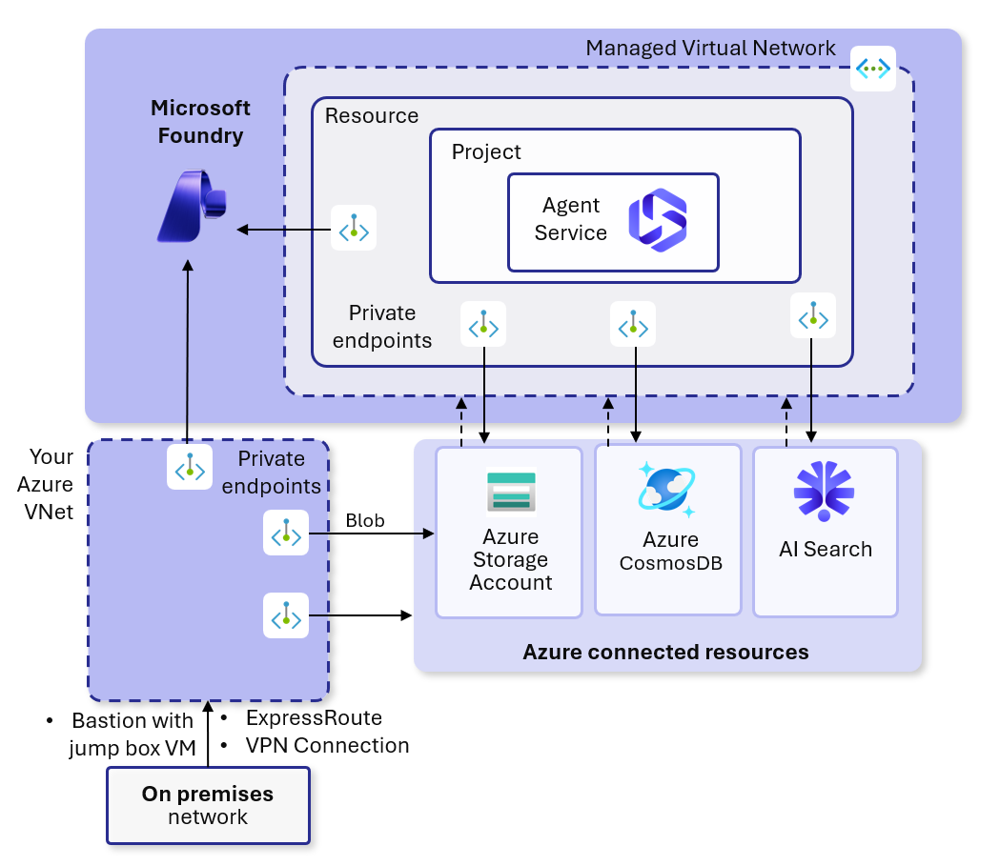

# Application Landing Zone — AI Foundry (Managed VNet)

This is an optional application landing zone. It deploys AI Foundry with AI Agent Service and private endpoints in a Microsoft-managed VNet. You do not need to deploy this to use the Networking module on its own.

This module is based on the [PG-validated Terraform sample](https://github.com/microsoft-foundry/foundry-samples/tree/main/infrastructure/infrastructure-setup-terraform/18-managed-virtual-network-preview), modified to pull network dependencies from the platform landing zone via `terraform_remote_state`.

"Secure" refers to the use of private endpoints. The environment still allows API keys by default. Set `disableLocalAuth` to `True` in the Terraform code to require Entra-only auth.

The template follows the [documented architecture](https://learn.microsoft.com/en-us/azure/ai-foundry/how-to/managed-virtual-network?view=foundry) for AI Foundry Standard Setup with a managed network.

## Prerequisites

- All [platform landing zone prerequisites](../README.md#prerequisites)
- Platform Landing Zone (`Networking/`) must be applied first with `create_AiLZ = true`
- Private DNS zones must be deployed (`add_privateDNS00 = true` in Networking)
- Azure region with AI Foundry support and sufficient quota

Foundry and its required resources deploy in your primary region only.

## Cleanup Steps

### Purge AI Foundry deleted item

After you run terraform destroy you'll still have Foundry in a soft delete state. You need to purge this first before you can run terraform destroy on the network foundation. The Foundry resource will retain the 'serviceassociationlink' to the AI subnet. This is documented below. Around 10+ minutes you should be able to destroy the network foundation.

- Purge a deleted resource - https://learn.microsoft.com/en-us/azure/ai-services/recover-purge-resources?tabs=azure-cli#purge-a-deleted-resource

## Troubleshooting

I've run into a couple quota related issues during model deployments. This may help if you run into errors.

- "The subscription does not have QuotaId/Feature required by SKU 'S0' from kind 'OpenAI' or contains blocked QuotaId/Feature."
  - Double check that you're using a supported region and have quota. You can check the region availability table in the doc below. You can also check your quota in your AI Foundry Management Center.
  - Region availability table - https://learn.microsoft.com/en-us/azure/ai-foundry/openai/concepts/models?tabs=global-standard%2Cstandard-chat-completions#model-summary-table-and-region-availability
- InsufficientQuota error "This operation require 10 new capacity in quota Tokens Per Minute (thousands) - gpt-4o, which is bigger than the current available capacity 0. The current quota usage is 30 and the quota limit is 30 for quota Tokens Per Minute (thousands) - gpt-4o."
  - You have quota but it's completely consumed by your other deployments. Delete another deployment or reduce the capacity you've assigned to it.
