# Networking Foundation

The Terraform deployment in this folder will deploy an Azure Virtual WAN environment that can be used as the foundation for demos (not production environments). There are conditional variables to add any of the following:

- a secondary region w/ vWAN
- Azure Firewall in either or both regions
- Azure Private DNS in either or both regions (Private DNS Zones and Private Resolver)
  - DNS Security Policy logging to a Log Analytics Workspace
- Virtual network for secure AI Foundry deployment (vNet only in this deployment)
- Azure VPN Gateway in either or both regions

## Notes

Azure Firewall is deployed with Routing Intent enabled for both Private and Internet traffic. However, the firewall policy allows any/any. Update firewall rules, as appropriate, for your tests.

Azure VPN Gateway is deployed without an environment on the other end. You can connect it to an existing on-prem or deploy another Azure environment to simulate on-prem. This is out of scope for now.

Azure DNS Private Zones are deployed using the Azure Verified Module "Private Link Private DNS Zones" under Pattern Modules. This deploys every available privatelink zone with a few exceptions. The most important exception is "privatelink.{dnsPrefix}.database.windows.net". You'll have to manually create this zone if you need it in your lab.

- Azure Verified Modules - https://azure.github.io/Azure-Verified-Modules/indexes/terraform/tf-pattern-modules/
- Direct link to exceptions - https://github.com/Azure/terraform-azurerm-avm-ptn-network-private-link-private-dns-zones?tab=readme-ov-file#-private_link_private_dns_zones

The default primary region (region 0) is Sweden Central. The default secondary region (region 1) is Central US. You can change these regions by updating them in the variables file. Update both the full region name and abbreviation.

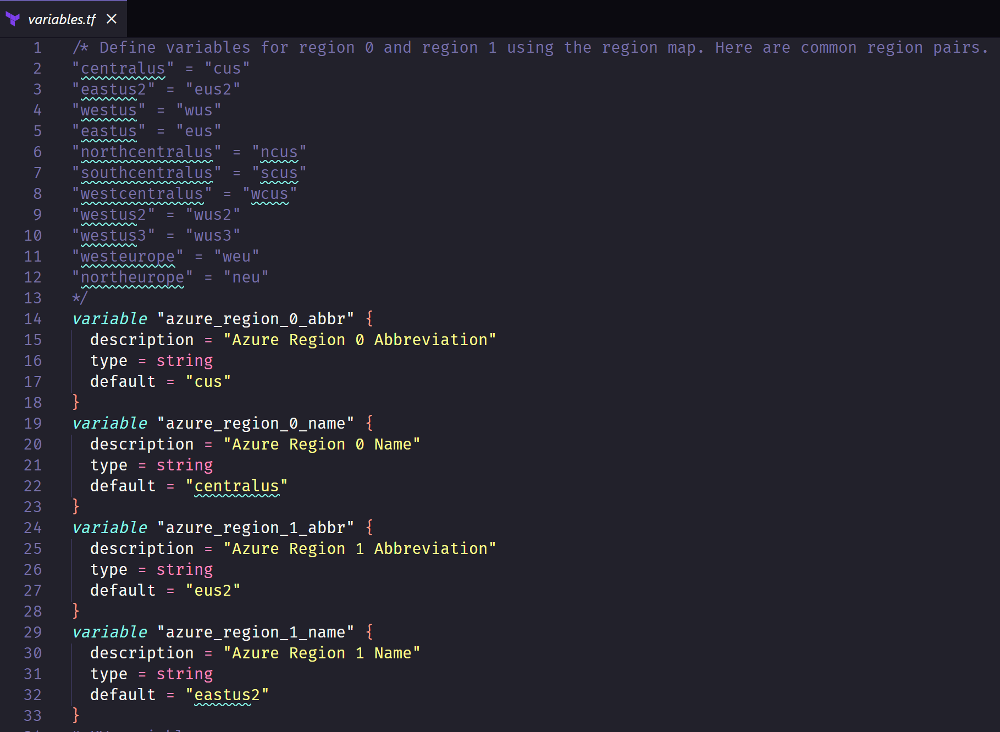

The default size for the linux test machines is Standard_b2s. During testing I ran into capacity constraints so I added VM size variables. You can modify that in the variables file or tfvars.

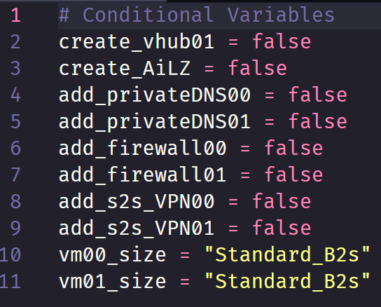

## Using the conditionals

The default for all conditionals is false (set in the variables file). This means they will not be deployed. In order to use the conditionals you need to update their value to true. The easiest way to do this is to use a tfvars file to update the variables. I've included two examples:

- terraform.tfvars.example - Simple example that only includes the conditionals.
- terraform.tfvars.advanced.example - An example with conditionals and overriding the default IP scheme to avoid 10.0.0.0.

You can rename either file and save as "terraform.tfvars". Update the values to true and then run your terraform plan/apply.

## Examples

Below are examples of the various scenarios you can build using the conditionals with tfvars.

### 1 Region, vHub, w/ DNS & VPN

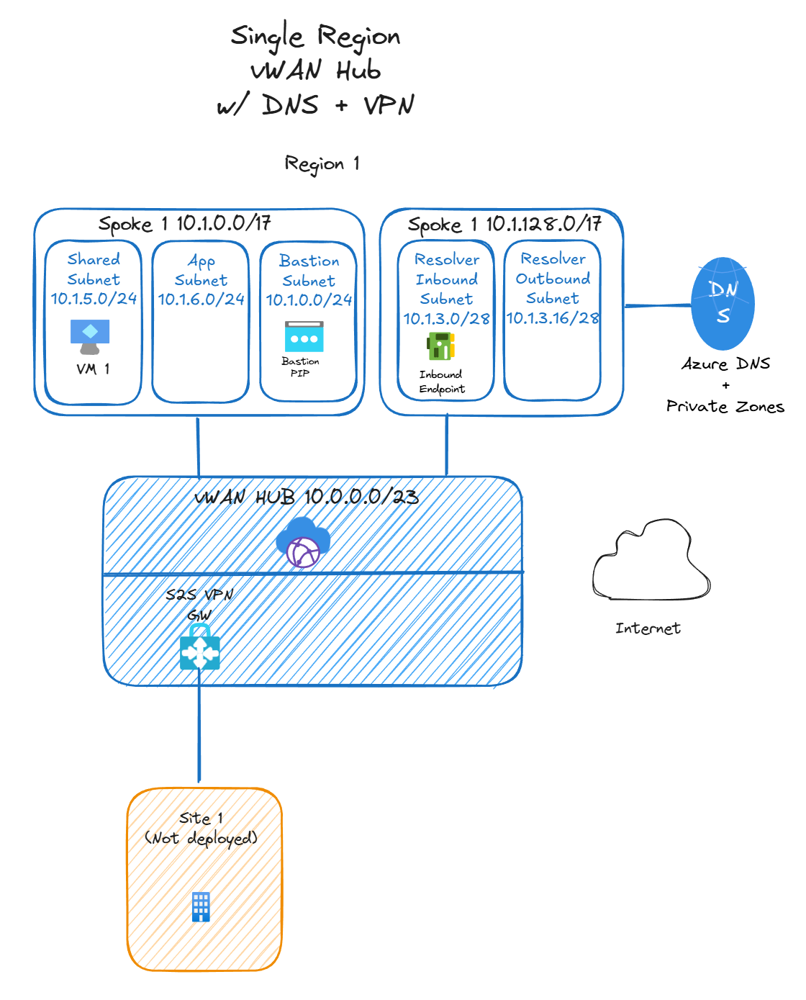
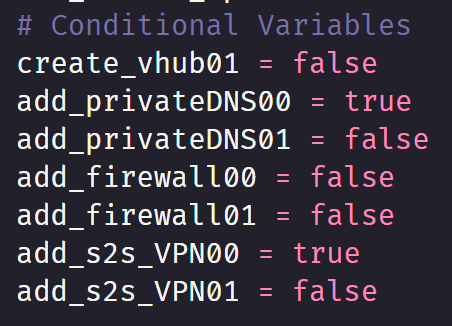

### 1 Region, vHub, w/o DNS or VPN (default deployment without tfvars in place)

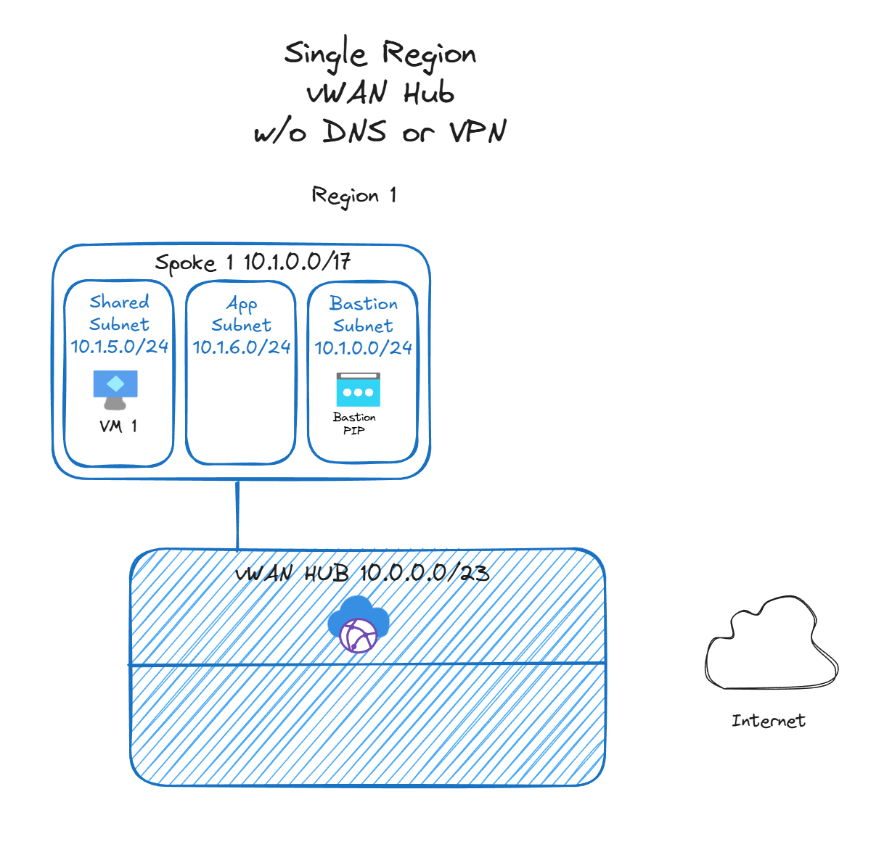
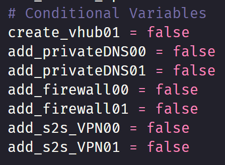

### 1 Region, Secure Hub, w/ DNS & VPN

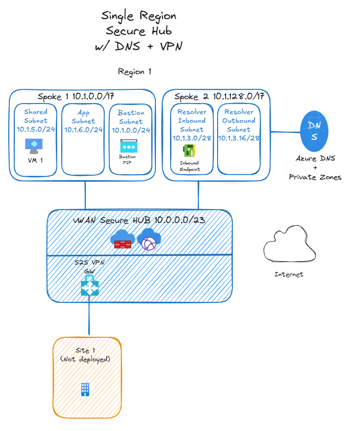
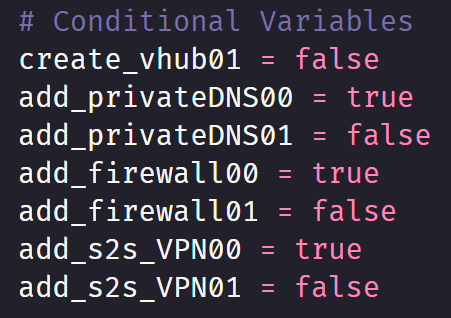

### 1 Region, Secure Hub, w/o DNS or VPN

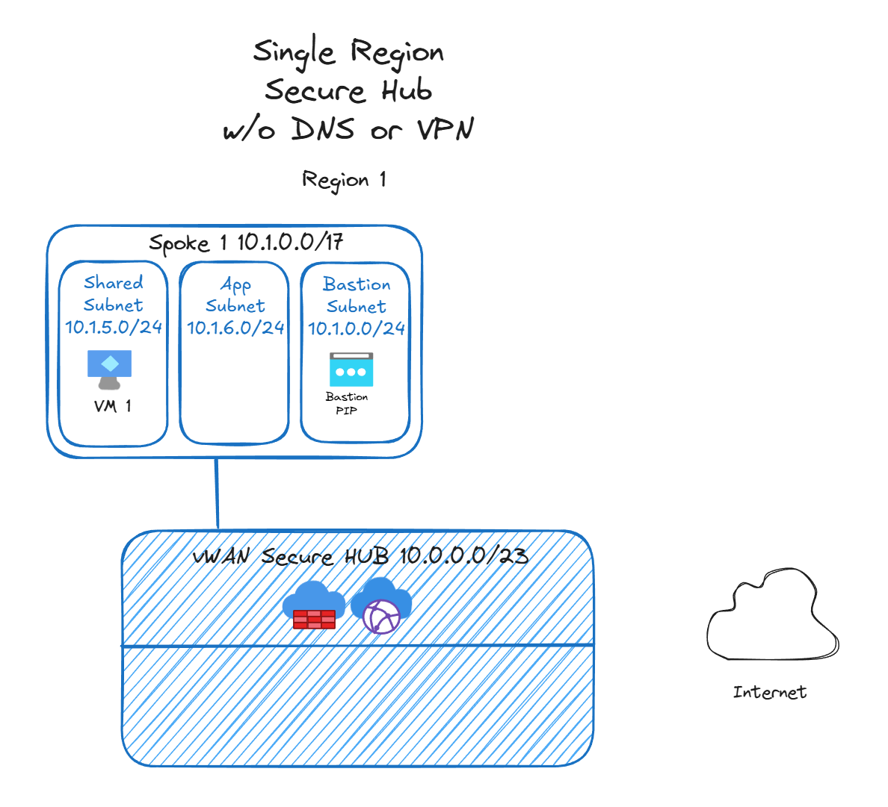
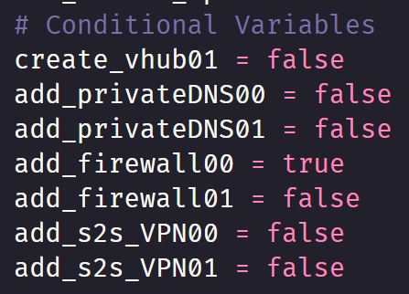

### 2 Regions, vHub, w/ DNS & VPN

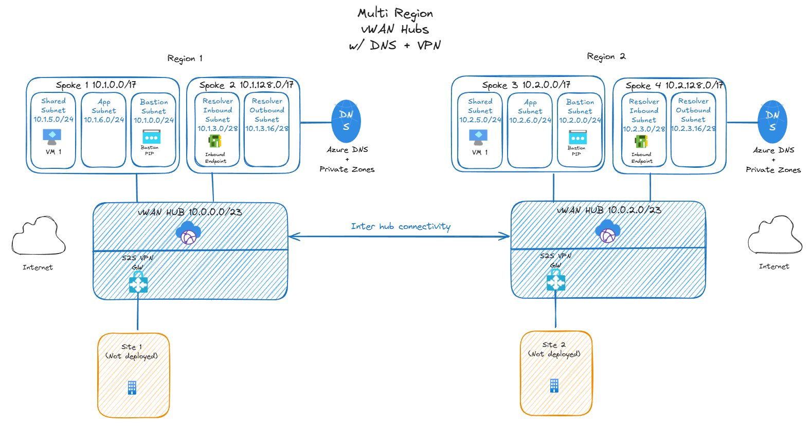
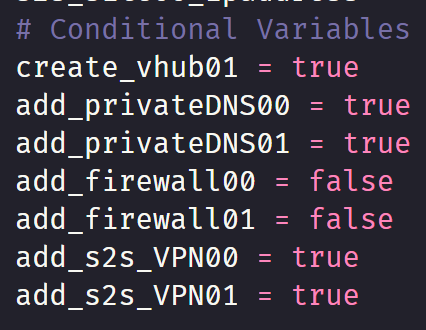

### 2 Regions, vHub, w/o DNS or VPN

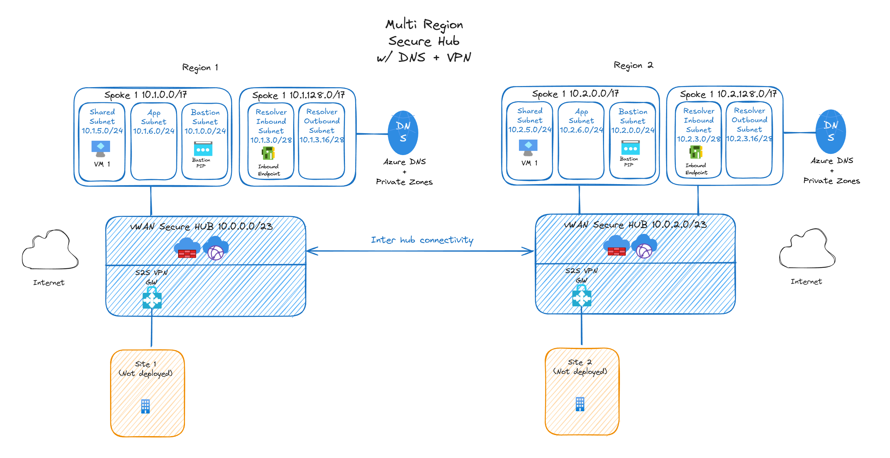
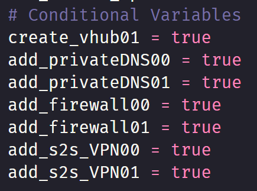
