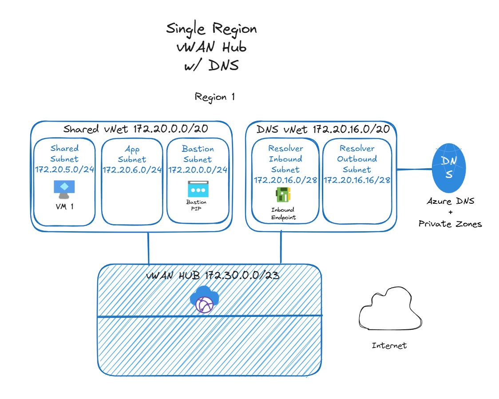
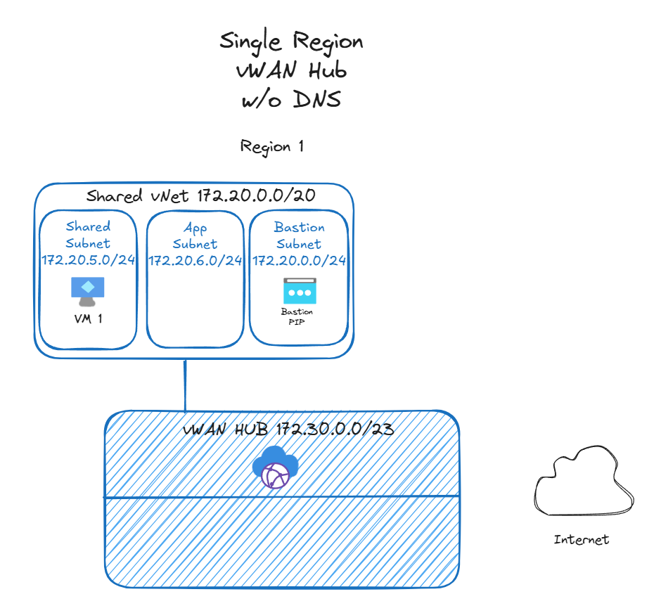
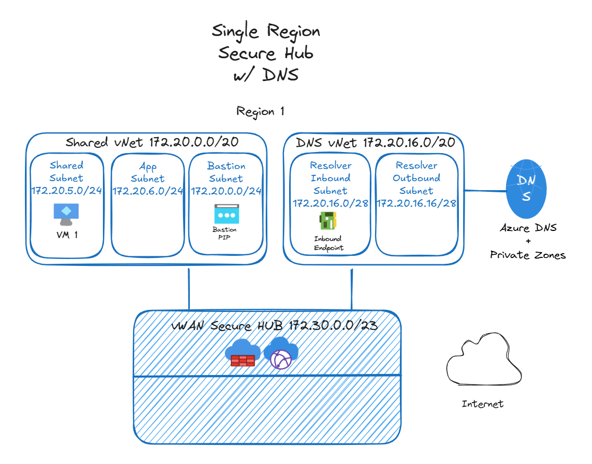
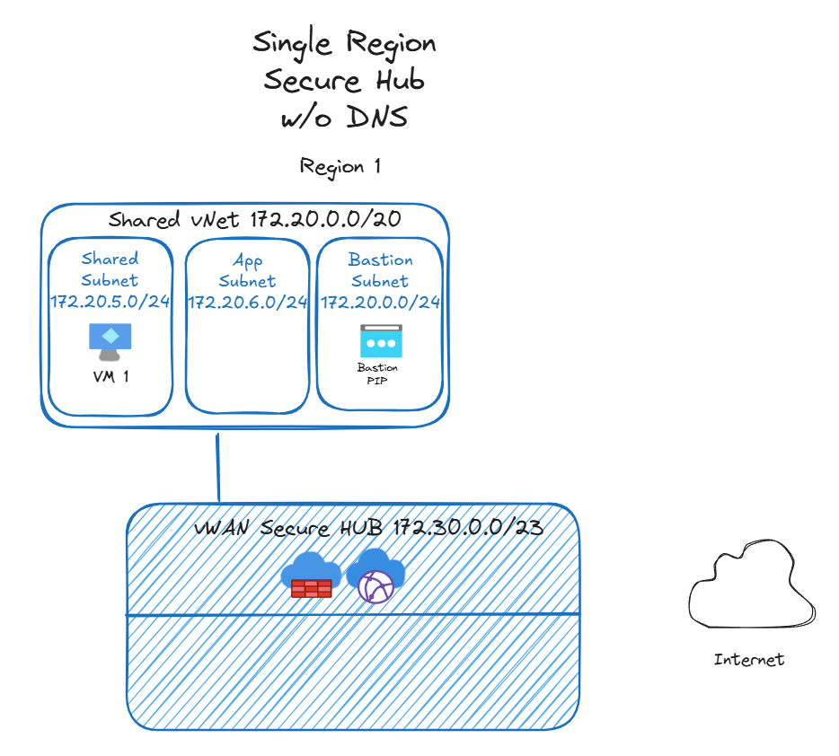
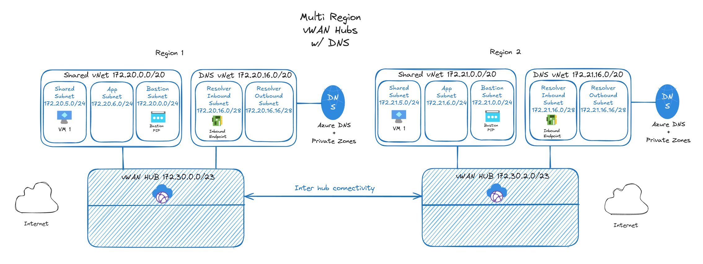
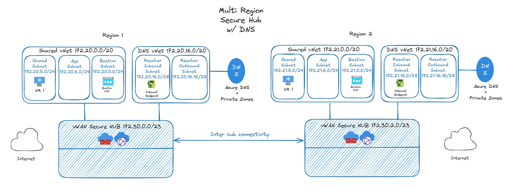

# Platform Landing Zone — Networking

This is the shared networking foundation that all application landing zones in this repo depend on. It deploys an Azure Virtual WAN environment for demos and labs (not production).

## What Gets Deployed

The base deployment creates a Virtual WAN, a virtual hub, a spoke VNet, and a test VM. Boolean variables toggle optional components. All default to `false`.

### Conditional Variables

| Variable            | Default | What It Enables                                             |
| ------------------- | ------- | ----------------------------------------------------------- |
| `create_vhub01`     | `false` | Second region (hub, VNets, VMs)                             |
| `add_firewall00`    | `false` | Azure Firewall in region 0                                  |
| `add_firewall01`    | `false` | Azure Firewall in region 1 (requires `create_vhub01`)       |
| `add_private_dns00` | `false` | Private DNS Resolver in region 0                            |
| `add_private_dns01` | `false` | Private DNS Resolver in region 1 (requires `create_vhub01`) |

## Quick Start

```sh
cd Networking
terraform init
terraform plan
terraform apply
```

Create a `terraform.tfvars` file to enable optional components (see [Using the Conditionals](#using-the-conditionals) below).

## Prerequisites

- Azure CLI installed and authenticated (`az login`)
- Terraform >= 1.8.3
- `ARM_SUBSCRIPTION_ID` environment variable set (see `setSubscription.ps1` in the repo root)
- Sufficient Azure quota in your target region(s)

## Downstream Dependencies

Application landing zone modules (`Foundry-byoVnet/`, `Foundry-managedVnet/`) consume this module's outputs via `terraform_remote_state` (local backend, reads `./terraform.tfstate`). Each Foundry module creates its own spoke VNet and subnets — no Networking toggle is required. If you need private DNS resolution for Foundry, set `add_private_dns00 = true`.

## Outputs — Platform-to-ALZ Contract

Application landing zones consume these outputs via `terraform_remote_state`. This is the interface between the platform and ALZ layers.

| Output Name                     | Description                                                                |
| ------------------------------- | -------------------------------------------------------------------------- |
| `vm_admin_username`             | Virtual Machine Admin Username                                             |
| `rg_net00_id`                   | The ID of the Networking Resource Group                                    |
| `rg_net00_name`                 | The name of the Networking Resource Group                                  |
| `rg_net00_location`             | The location of the Networking Resource Group                              |
| `azure_region_0_abbr`           | The abbreviation of the Azure 0 region                                     |
| `add_firewall00`                | Whether Azure Firewall is deployed in region 0                             |
| `vhub00_id`                     | The ID of Virtual Hub 00                                                   |
| `vhub01_id`                     | The ID of Virtual Hub 01 (null if `create_vhub01 = false`)                 |
| `log_analytics_workspace_id`    | The ID of the Log Analytics Workspace                                      |
| `key_vault_id`                  | The ID of Key Vault                                                        |
| `key_vault_name`                | The name of Key Vault                                                      |
| `dns_resolver_policy00_id`      | The DNS resolver policy ID (null if `add_private_dns00 = false`)           |
| `dns_inbound_endpoint00_ip`     | The DNS resolver inbound endpoint IP (null if `add_private_dns00 = false`) |
| `dns_zone_blob_id`              | Private DNS Zone ID for `privatelink.blob.core.windows.net`                |
| `dns_zone_file_id`              | Private DNS Zone ID for `privatelink.file.core.windows.net`                |
| `dns_zone_table_id`             | Private DNS Zone ID for `privatelink.table.core.windows.net`               |
| `dns_zone_queue_id`             | Private DNS Zone ID for `privatelink.queue.core.windows.net`               |
| `dns_zone_vaultcore_id`         | Private DNS Zone ID for `privatelink.vaultcore.azure.net`                  |
| `dns_zone_cognitiveservices_id` | Private DNS Zone ID for `privatelink.cognitiveservices.azure.com`          |
| `dns_zone_openai_id`            | Private DNS Zone ID for `privatelink.openai.azure.com`                     |
| `dns_zone_services_ai_id`       | Private DNS Zone ID for `privatelink.services.ai.azure.com`                |
| `dns_zone_search_id`            | Private DNS Zone ID for `privatelink.search.windows.net`                   |
| `dns_zone_documents_id`         | Private DNS Zone ID for `privatelink.documents.azure.com`                  |
| `firewall_private_ip00`         | The private IP of Azure Firewall in region 0 (null if firewall not deployed) |
| `dns_server_ip00`               | DNS server IP for spoke VNets — firewall IP when deployed, otherwise DNS resolver inbound IP |

DNS zone outputs are null when `add_private_dns00 = false`.

## CIDR Allocation

Each region uses a `172.2x.0.0/16` supernet split into `/20` blocks. Virtual hub prefixes use a separate `172.30.x.x` range. See [docs/ip-addressing.md](../docs/ip-addressing.md) for the full allocation scheme.

### Virtual Hub Prefixes

| Resource | CIDR            | Region                    |
| -------- | --------------- | ------------------------- |
| vHub 00  | `172.30.0.0/23` | Sweden Central (region 0) |
| vHub 01  | `172.30.2.0/23` | Central US (region 1)     |

### Region 0 — `172.20.0.0/16`

| Block | CIDR                                 | Purpose                      | Subnets                                                              |
| ----- | ------------------------------------ | ---------------------------- | -------------------------------------------------------------------- |
| 0     | `172.20.0.0/20`                      | Platform — Shared spoke VNet | Bastion `172.20.0.0/24`, Shared `172.20.5.0/24`, App `172.20.6.0/24` |
| 1     | `172.20.16.0/20`                     | Platform — DNS VNet          | Inbound `172.20.16.0/28`, Outbound `172.20.16.16/28`                 |
| 2     | `172.20.32.0/20`                     | App LZ — Foundry-byoVnet     | AI Foundry `172.20.32.0/26`, Private Endpoints `172.20.33.0/24`      |
| 3     | `172.20.48.0/20`                     | App LZ — Foundry-managedVnet | AI Foundry `172.20.48.0/26`, Private Endpoints `172.20.49.0/24`      |
| 4–15  | `172.20.64.0/20` – `172.20.240.0/20` | Unassigned                   | Available for future app landing zones                               |

### Region 1 — `172.21.0.0/16`

| Block | CIDR                                 | Purpose                                 | Subnets                                                              |
| ----- | ------------------------------------ | --------------------------------------- | -------------------------------------------------------------------- |
| 0     | `172.21.0.0/20`                      | Platform — Shared spoke VNet            | Bastion `172.21.0.0/24`, Shared `172.21.5.0/24`, App `172.21.6.0/24` |
| 1     | `172.21.16.0/20`                     | Platform — DNS VNet                     | Inbound `172.21.16.0/28`, Outbound `172.21.16.16/28`                 |
| 2     | `172.21.32.0/20`                     | Reserved — Foundry-byoVnet (future)     | —                                                                    |
| 3     | `172.21.48.0/20`                     | Reserved — Foundry-managedVnet (future) | —                                                                    |
| 4–15  | `172.21.64.0/20` – `172.21.240.0/20` | Unassigned                              | Available for future app landing zones                               |

## Module Structure (for contributors)

Internally, the Networking module uses a `modules/region-hub/` child module to avoid duplicating per-region resource blocks. The root module calls it twice:

- `module.region0` — always created (region 0)
- `module.region1` — conditional on `create_vhub01` (`count = var.create_vhub01 ? 1 : 0`)

Each call maps flat root variables (with `00`/`01` suffixes) to the child module's generic inputs. The child module contains the hub, shared VNet, subnets, firewall, DNS resolver, and compute resources for a single region.

**This doesn't change how you use the module.** Variables, outputs, and tfvars all work the same as before. The child module is an internal detail.

```
Networking/
├── main.tf                     # RGs, Log Analytics, module calls
├── vwan.tf                     # Virtual WAN
├── keyvault.tf                 # Key Vault
├── variables.tf                # All root variables (flat, per-region)
├── outputs.tf                  # Platform-to-ALZ contract
├── locals.tf
├── config.tf
└── modules/
    └── region-hub/
        ├── main.tf             # Per-region resources (hub, VNet, firewall, DNS, compute)
        ├── variables.tf        # Generic region inputs
        └── outputs.tf          # Region outputs (hub ID, subnet IDs, etc.)
```

## Notes

Azure Firewall is deployed with Routing Intent enabled for both Private and Internet traffic. The firewall policy allows any/any by default. Update firewall rules as needed for your tests.

Azure DNS Private Zones are deployed using the Azure Verified Module "Private Link Private DNS Zones" under Pattern Modules. This deploys every available privatelink zone with a few exceptions. The most important exception is `privatelink.{dnsPrefix}.database.windows.net`. You'll have to manually create this zone if you need it.

- [Azure Verified Modules](https://azure.github.io/Azure-Verified-Modules/indexes/terraform/tf-pattern-modules/)
- [Exceptions list](https://github.com/Azure/terraform-azurerm-avm-ptn-network-private-link-private-dns-zones?tab=readme-ov-file#-private_link_private_dns_zones)

VMs deployed into a VNet with custom DNS servers may not pick up the DNS settings on first boot. Azure DHCP leases are extremely long (~127 years) and don't have a scheduled renewal, so the VM can boot with default Azure DNS before the custom settings take effect. A reboot or `ipconfig /renew` inside the VM will fix it. This is normal Azure platform behavior, not a Terraform issue.

## Regions

The default primary region (region 0) is Sweden Central. The default secondary region (region 1) is Central US. Change these in tfvars or variables — update both the full region name and abbreviation.

```
# ── Region name → abbreviation pairs ────────
# "centralus"      = "cus"
# "eastus2"        = "eus2"
# "westus"         = "wus"
# "eastus"         = "eus"
# "northcentralus" = "ncus"
# "southcentralus" = "scus"
# "westcentralus"  = "wcus"
# "westus2"        = "wus2"
# "westus3"        = "wus3"
# "westeurope"     = "weu"
# "northeurope"    = "neu"
# "swedencentral"  = "sece"

# ── Region 0 ─────────────────────────────────
azure_region_0_name = "swedencentral"
azure_region_0_abbr = "sece"

# ── Region 1 ─────────────────────────────────
azure_region_1_name = "centralus"
azure_region_1_abbr = "cus"
```

## VM Sizing

The default VM size is Standard_B2s. If you hit capacity constraints, override it in your tfvars.

```
# ── VM sizing ────────────────────────────────
vm00_size = "Standard_B2s"
vm01_size = "Standard_B2s"
```

## Using the Conditionals

All conditionals default to `false`. To enable them, create a `terraform.tfvars` file. Two examples are included:

- `terraform.tfvars.example` — Simple, conditionals only.
- `terraform.tfvars.advanced.example` — Conditionals plus custom IP address ranges.

Rename either file to `terraform.tfvars`, set the values you want to `true`, then run `terraform plan` and `terraform apply`.

## Examples

Below are examples of various configurations you can build with different tfvars combinations.

### 1 Region, vHub, w/ DNS

Single region with a virtual hub and Private DNS Resolver enabled.



```
# ── Feature toggles ─────────────────────────
create_vhub01     = false # Set true to deploy the second region
add_firewall00    = false
add_firewall01    = false
add_private_dns00 = true
add_private_dns01 = false
```

### 1 Region, vHub (default deployment, no tfvars)

Bare minimum — one hub, one spoke VNet, one VM. No firewall or DNS.



```
# ── Feature toggles ─────────────────────────
create_vhub01     = false # Set true to deploy the second region
add_firewall00    = false
add_firewall01    = false
add_private_dns00 = false
add_private_dns01 = false
```

### 1 Region, Secure Hub, w/ DNS

Single region with Azure Firewall (Routing Intent) and Private DNS Resolver.



```
# ── Feature toggles ─────────────────────────
create_vhub01     = false # Set true to deploy the second region
add_firewall00    = true
add_firewall01    = false
add_private_dns00 = true
add_private_dns01 = false
```

### 1 Region, Secure Hub

Single region with Azure Firewall (Routing Intent) but no DNS resolver.



```
# ── Feature toggles ─────────────────────────
create_vhub01     = false # Set true to deploy the second region
add_firewall00    = true
add_firewall01    = false
add_private_dns00 = false
add_private_dns01 = false
```

### 2 Regions, vHub, w/ DNS

Two regions, each with a hub and DNS resolver. No firewall.



```
# ── Feature toggles ─────────────────────────
create_vhub01     = true # Set true to deploy the second region
add_firewall00    = false
add_firewall01    = false
add_private_dns00 = true
add_private_dns01 = true
```

### 2 Regions, Secure vHub, w/ DNS

Two regions with Azure Firewall and DNS resolver in both.



```
# ── Feature toggles ─────────────────────────
create_vhub01     = true # Set true to deploy the second region
add_firewall00    = true
add_firewall01    = true
add_private_dns00 = true
add_private_dns01 = true
```
