# Platform Landing Zone — Networking

This is the shared networking foundation that all application landing zones in this repo depend on. It deploys an Azure Virtual WAN environment for demos and labs (not production).

## What Gets Deployed

The base deployment creates a Virtual WAN, a virtual hub, a spoke VNet, and a test VM. Boolean variables toggle optional components:

| Variable | What it adds |
|---|---|
| `create_vhub01` | Second region (hub, VNets, VMs) |
| `create_AiLZ` | AI Landing Zone spoke VNet (required before any Foundry module) |
| `add_firewall00` / `add_firewall01` | Azure Firewall per region |
| `add_privateDNS00` / `add_privateDNS01` | Private DNS Resolver per region |

All conditionals default to `false`.

## Prerequisites

- Azure CLI installed and authenticated (`az login`)
- Terraform >= 1.8.3
- `ARM_SUBSCRIPTION_ID` environment variable set (see `setSubscription.ps1` in the repo root)
- Sufficient Azure quota in your target region(s)

## Downstream Dependencies

Application landing zone modules (`Foundry-byoVnet/`, `Foundry-managedVnet/`) consume this module's outputs via `terraform_remote_state` (local backend, reads `./terraform.tfstate`). You must apply this module with `create_AiLZ = true` before deploying any Foundry module. If you need private DNS resolution for Foundry, also set `add_privateDNS00 = true`.

## Notes

Azure Firewall is deployed with Routing Intent enabled for both Private and Internet traffic. The firewall policy allows any/any by default. Update firewall rules as needed for your tests.

Azure DNS Private Zones are deployed using the Azure Verified Module "Private Link Private DNS Zones" under Pattern Modules. This deploys every available privatelink zone with a few exceptions. The most important exception is `privatelink.{dnsPrefix}.database.windows.net`. You'll have to manually create this zone if you need it.

- [Azure Verified Modules](https://azure.github.io/Azure-Verified-Modules/indexes/terraform/tf-pattern-modules/)
- [Exceptions list](https://github.com/Azure/terraform-azurerm-avm-ptn-network-private-link-private-dns-zones?tab=readme-ov-file#-private_link_private_dns_zones)

## Regions

The default primary region (region 0) is Sweden Central. The default secondary region (region 1) is Central US. Change these in the variables file — update both the full region name and abbreviation.

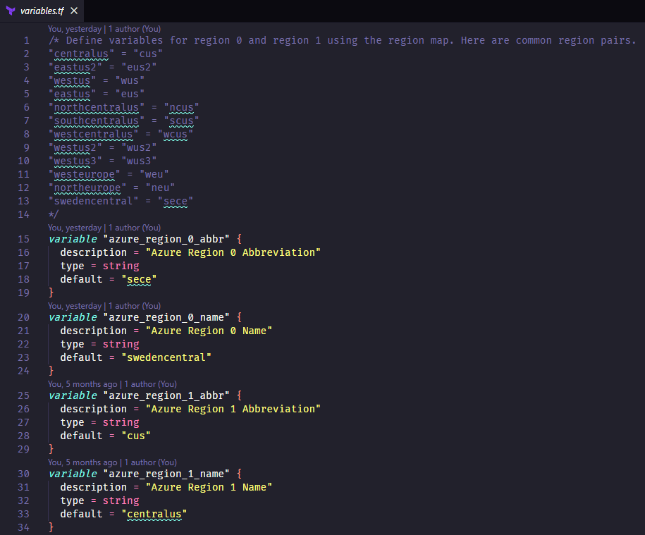

## VM Sizing

The default VM size is Standard_B2s. If you hit capacity constraints, override it in your tfvars.

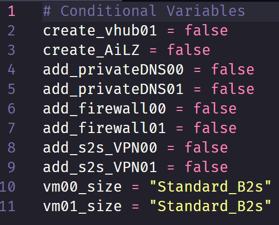

## Using the Conditionals

All conditionals default to `false`. To enable them, create a `terraform.tfvars` file. Two examples are included:

- `terraform.tfvars.example` — Simple, conditionals only.
- `terraform.tfvars.advanced.example` — Conditionals plus custom IP address ranges.

Rename either file to `terraform.tfvars`, set the values you want to `true`, then run `terraform plan` and `terraform apply`.

## Examples

Below are examples of various configurations you can build with different tfvars combinations.

### 1 Region, vHub, w/ DNS

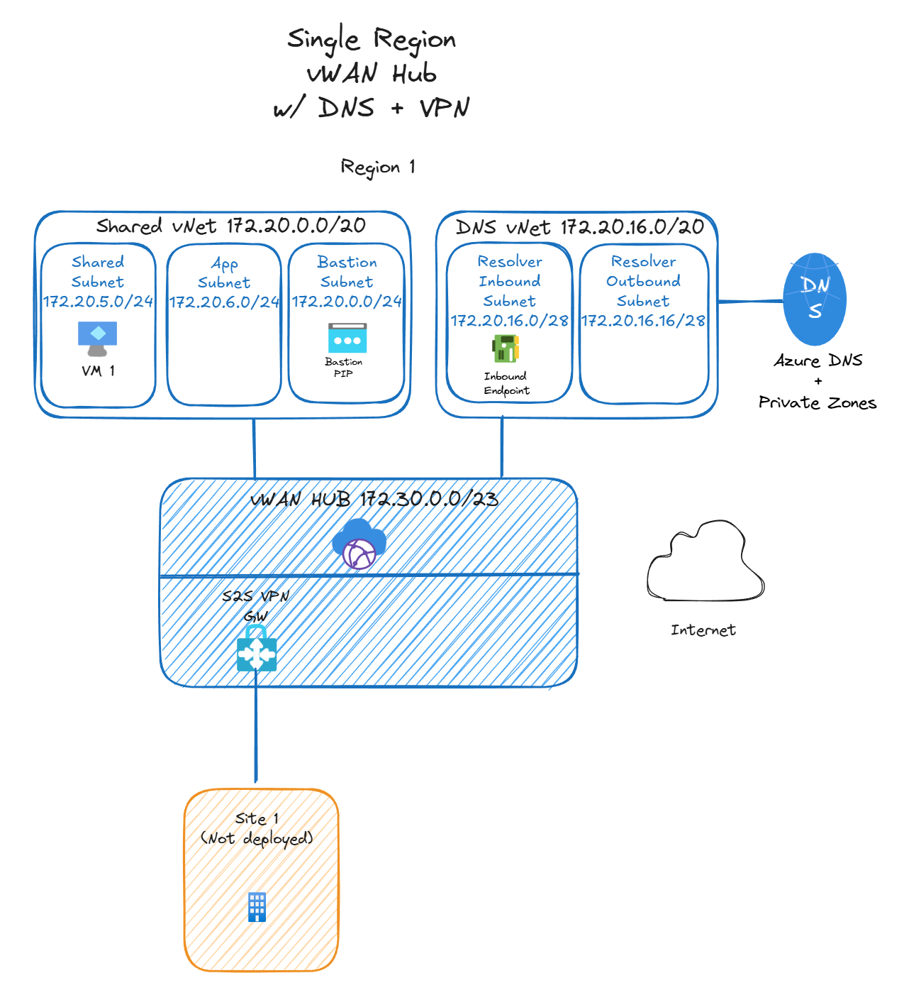
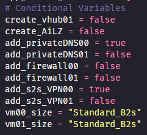

### 1 Region, vHub (default deployment, no tfvars)

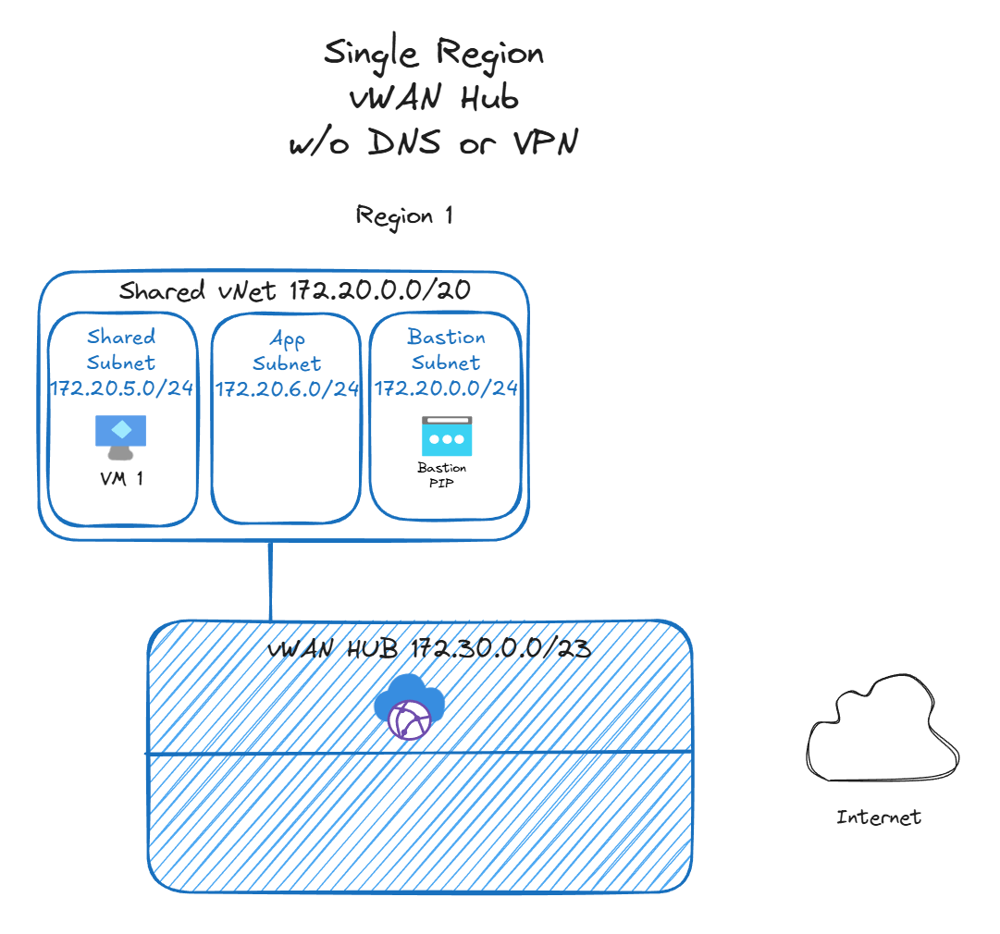
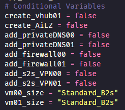

### 1 Region, Secure Hub, w/ DNS

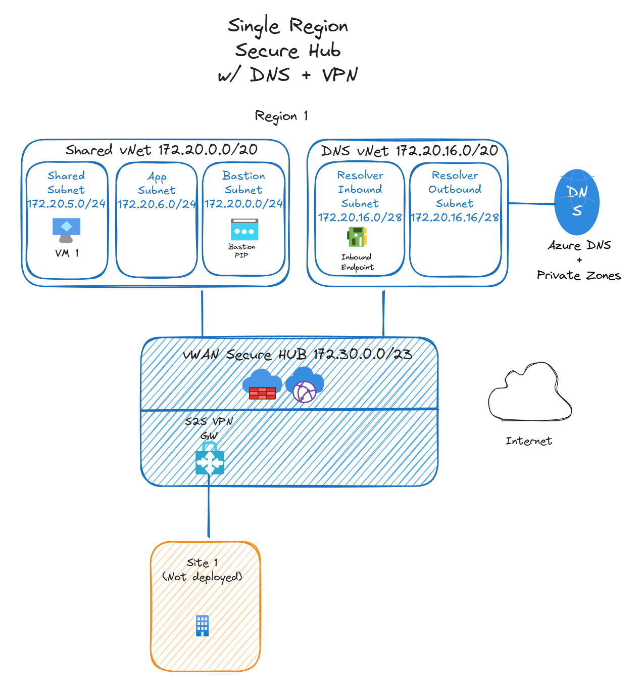
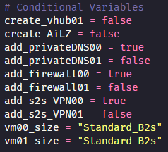

### 1 Region, Secure Hub

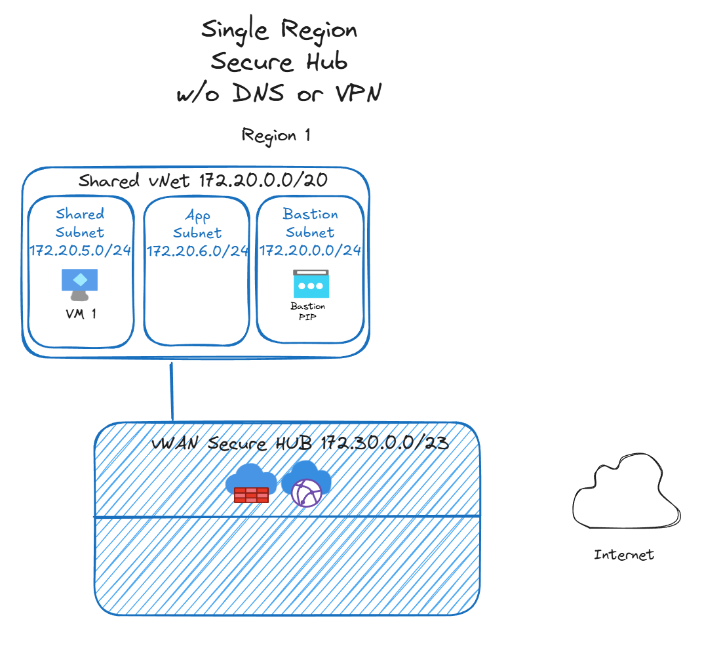
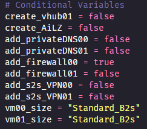

### 2 Regions, vHub, w/ DNS

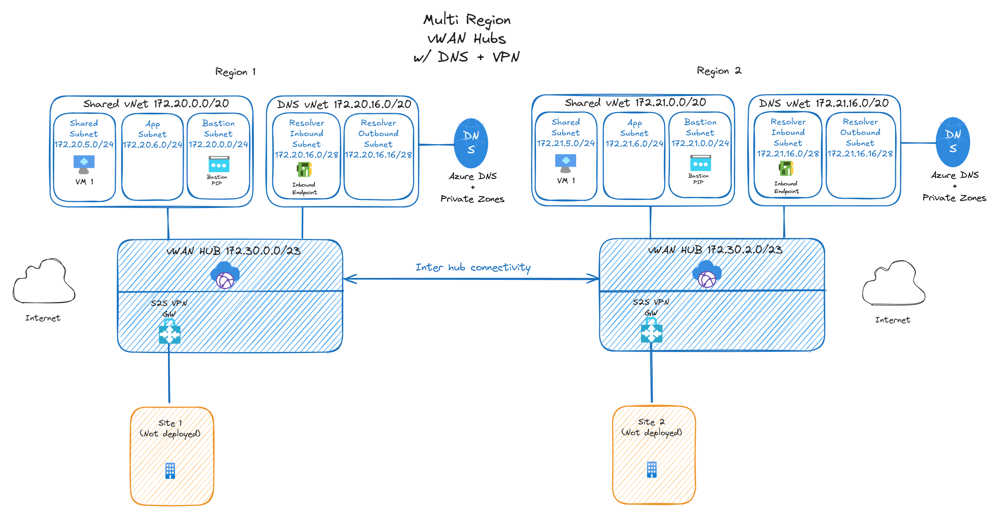
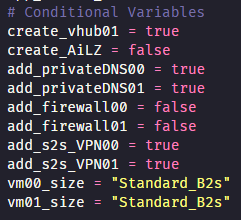

### 2 Regions, Secure vHub, w/ DNS

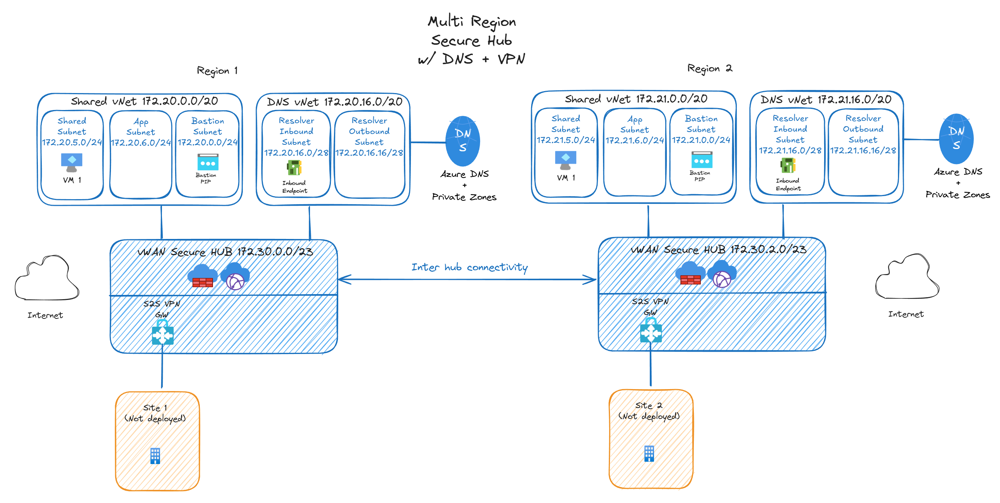
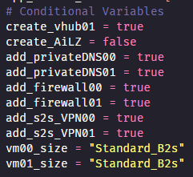

### Add-on — AI Landing Zone VNet for Foundry

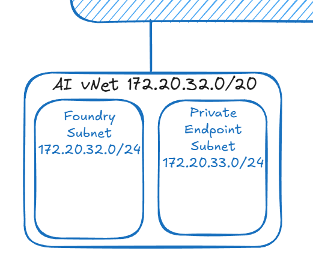

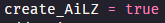
