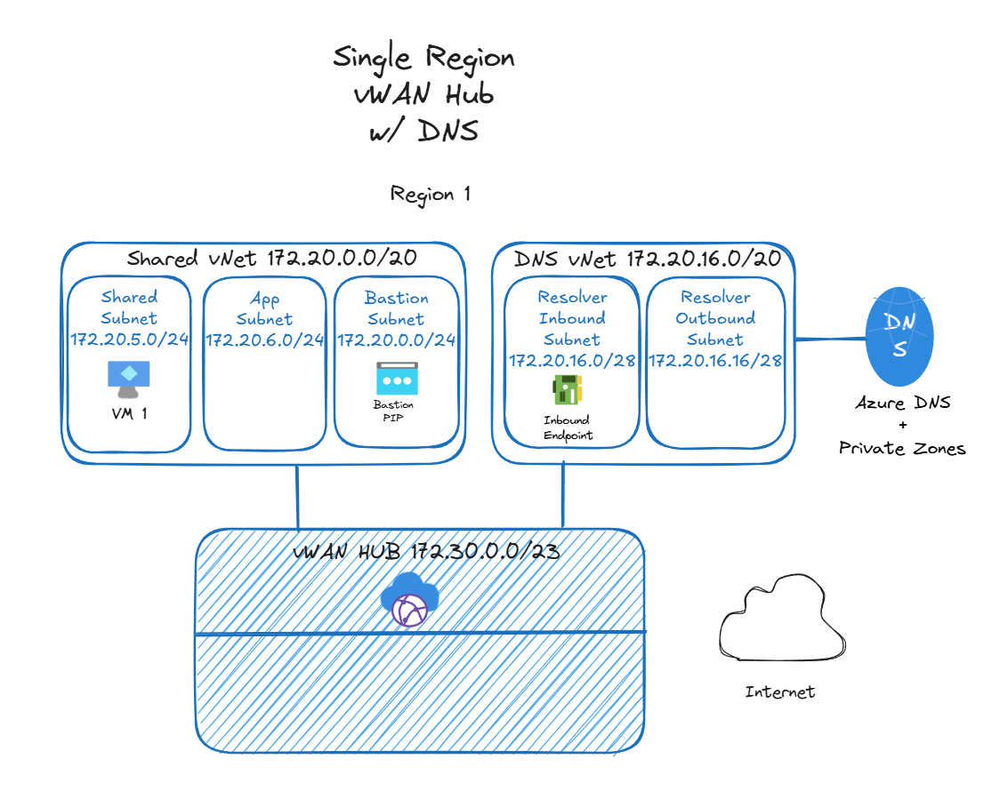
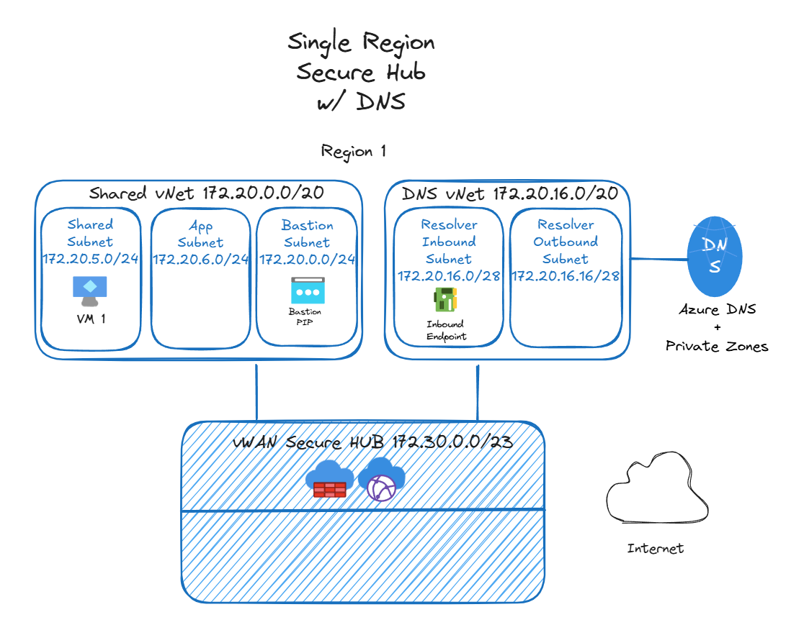
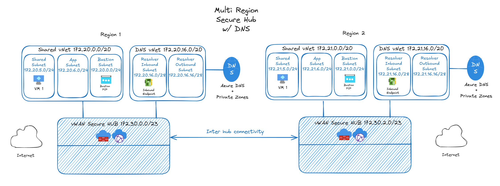

# Platform Landing Zone — Networking

This is the shared networking foundation that all application landing zones in this repo depend on. It deploys an Azure Virtual WAN environment for demos and labs (not production).

This can be used for demoing or testing network platform capabilities. It can also be used as a secure networking foundation for optional application landing zones.

## What Gets Deployed

**Base deployment:** Virtual WAN, virtual hub, spoke VNet, and test VM.

**Optionals:** Azure Firewall, Private DNS Resolver, and a second region. All default to `false`. Enable them in your `terraform.tfvars`:

| Toggle              | Enables                                            |
| ------------------- | -------------------------------------------------- |
| `create_vhub01`     | Second region (hub, VNets, VMs)                    |
| `add_firewall00`    | Azure Firewall in region 0                         |
| `add_firewall01`    | Azure Firewall in region 1 (requires vhub01)       |
| `add_private_dns00` | Private DNS Resolver in region 0                   |
| `add_private_dns01` | Private DNS Resolver in region 1 (requires vhub01) |

See `variables.tf` for the full configuration options (VNet ranges, VM sizes, region names, etc).

## Quick Start

```sh
cd Networking
terraform init && terraform apply
```

**Optional:** Create a `terraform.tfvars` to enable Firewall and Private DNS. Two examples:

- `terraform.tfvars.example` — Just the toggles
- `terraform.tfvars.advanced.example` — Toggles + custom IP ranges

Rename either to `terraform.tfvars`, set values to `true`, then `terraform plan` and `terraform apply`.

## Prerequisites

- Azure CLI installed and authenticated (`az login`)
- Terraform >= 1.11
- `ARM_SUBSCRIPTION_ID` environment variable set (see `setSubscription.ps1` in the repo root)
- Sufficient Azure quota in your target region(s)

## Downstream Dependencies

Application landing zone modules (`Foundry-byoVnet/`, `Foundry-managedVnet/`, `ContainerApps-byoVnet/`, and `Fabric-private/`) consume `alz_regions.region0` via `terraform_remote_state` (local backend, reads `./terraform.tfstate`). Each module creates its own spoke VNet and subnets. If a workload needs private DNS resolution, set `add_private_dns00 = true`.

## Outputs — Platform-to-ALZ Contract

Application landing zones consume these outputs via `terraform_remote_state`. See the full list in `outputs.tf`.

| Output | Purpose |
|---|---|
| `alz_regions` | Region 0 and optional region 1 resource group, vHub, Firewall, DNS, and Private DNS zone contract |
| `log_analytics_workspace_id` | Shared Log Analytics workspace used by application diagnostics |
| `vm_admin_username`, `vm_admin_password` | Credentials for the platform test VMs |

`alz_regions.region0` is always enabled. `alz_regions.region1.enabled` matches `create_vhub01`; its resource-derived values are null when region 1 is disabled. Application landing zones select their own deployment regions and must not assume that Networking region 1 automatically enables a second workload region.

### Inspect a deployed region

Run this example from `Networking/` after Terraform has created or refreshed the configured state. Set `$regionName` to the region you want to inspect:

```powershell
$regionName = 'region0' # or 'region1'
$alz = terraform output -json alz_regions | ConvertFrom-Json
$region = $alz.$regionName

$region | Format-List *
$region.private_dns_zone_ids | Format-List *
```

The first list shows the selected region's resource group, vHub, Firewall, and DNS fields. The second list expands the Private DNS zone names and values. A disabled region 1 remains visible with `enabled = false` and null resource-derived values.

## CIDR Allocation

Each region uses a `172.2x.0.0/16` supernet split into `/20` blocks. Virtual hub prefixes use a separate `172.30.x.x` range. Full allocation scheme is in [docs/ip-addressing.md](../docs/ip-addressing.md).

| Region   | vHub Prefix     | Shared VNet     | DNS VNet         | Foundry-byoVnet  | Foundry-managedVnet | Future       |
| -------- | --------------- | --------------- | ---------------- | ---------------- | ------------------- | ------------ |
| Region 0 | `172.30.0.0/23` | `172.20.0.0/20` | `172.20.16.0/20` | `172.20.32.0/20` | `172.20.48.0/20`    | `172.20.64+` |
| Region 1 | `172.30.2.0/23` | `172.21.0.0/20` | `172.21.16.0/20` | Reserved         | Reserved            | `172.21.64+` |

## Module Structure

For contributors: Networking uses an internal `modules/region-hub/` child module to avoid duplicating per-region blocks. The root module calls it twice (region 0 always, region 1 conditional on `create_vhub01`).

**This doesn't change how you use it.** Variables, outputs, and tfvars work the same. The child module is a code organization detail:

```
Networking/
├── main.tf, vwan.tf, credentials.tf, variables.tf, outputs.tf
└── modules/region-hub/
    ├── main.tf (per-region hub, VNet, firewall, DNS, compute)
    └── variables.tf, outputs.tf
```

## Notes

**VM credentials:** Terraform generates one password shared by the regional test VMs. The username includes the deployment's random numeric suffix. Retrieve both values explicitly when connecting through Bastion:

```sh
terraform output -raw vm_admin_username
terraform output -raw vm_admin_password
```

The password is stored in the local Terraform state. State files are excluded from Git and should be deleted with the lab.

**Firewall:** Deployed with Routing Intent enabled. Default policy is allow-all. Update rules as needed.

**Bastion:** Defaults to Standard SKU with native client support (`tunneling_enabled`) enabled. This lets you use `az network bastion` CLI commands for RDP/SSH instead of the portal. IP-based connections (`ip_connect_enabled`) were removed because they conflict with vWAN routing intent; use resource ID instead.

Connect via native RDP client:

```sh
az network bastion rdp \
  --name <bastion-name> --resource-group <rg-name> \
  --target-resource-id <vm-resource-id>
```

Example resource ID: `/subscriptions/<subscription-id>/resourceGroups/<rg-name>/providers/Microsoft.Compute/virtualMachines/<vm-name>`

Connect via native SSH client:

```sh
az network bastion ssh \
  --name <bastion-name> --resource-group <rg-name> \
  --target-resource-id <vm-resource-id> \
  --auth-type password --username yourAdminUser
```

Cross-VNet Bastion access is not supported in this vWAN topology.

**Private DNS:** Uses [Azure Verified Module](https://azure.github.io/Azure-Verified-Modules/indexes/terraform/tf-pattern-modules/) — deploys all common `privatelink.*` zones except `privatelink.{dnsPrefix}.database.windows.net` (create manually if needed). See [exceptions list](https://github.com/Azure/terraform-azurerm-avm-ptn-network-private-link-private-dns-zones?tab=readme-ov-file#-private_link_private_dns_zones).

> [!NOTE]
> Terraform may report that the AzAPI `retry.multiplier` and `retry.randomization_factor` attributes are deprecated. These values come from the nested Private DNS Zone AVM used by the upstream pattern, not from this repository's Terraform configuration. The warning does not affect deployment and requires no Azure resource or state cleanup. Do not edit files under `.terraform`; the warning will be removed when the upstream AVM updates its retry schema.

**Regions:** Defaults are Sweden Central (region 0) and Central US (region 1). Override in `terraform.tfvars` — update both the full name and abbreviation.

## Examples

Common configurations. See [terraform.tfvars.example](./terraform.tfvars.example) and [terraform.tfvars.advanced.example](./terraform.tfvars.advanced.example) for ready-to-use templates. Rename one to `terraform.tfvars` and set the toggles:

### Single Region + DNS Resolver

```hcl
create_vhub01     = false
add_firewall00    = false
add_private_dns00 = true
```



### Single Region + Firewall + DNS

```hcl
create_vhub01     = false
add_firewall00    = true
add_private_dns00 = true
```



### Two Regions + Firewall + DNS

```hcl
create_vhub01     = true
add_firewall00    = true
add_firewall01    = true
add_private_dns00 = true
add_private_dns01 = true
```



See [terraform.tfvars.advanced.example](./terraform.tfvars.advanced.example) to customize IP ranges, regions, or VM sizes.
