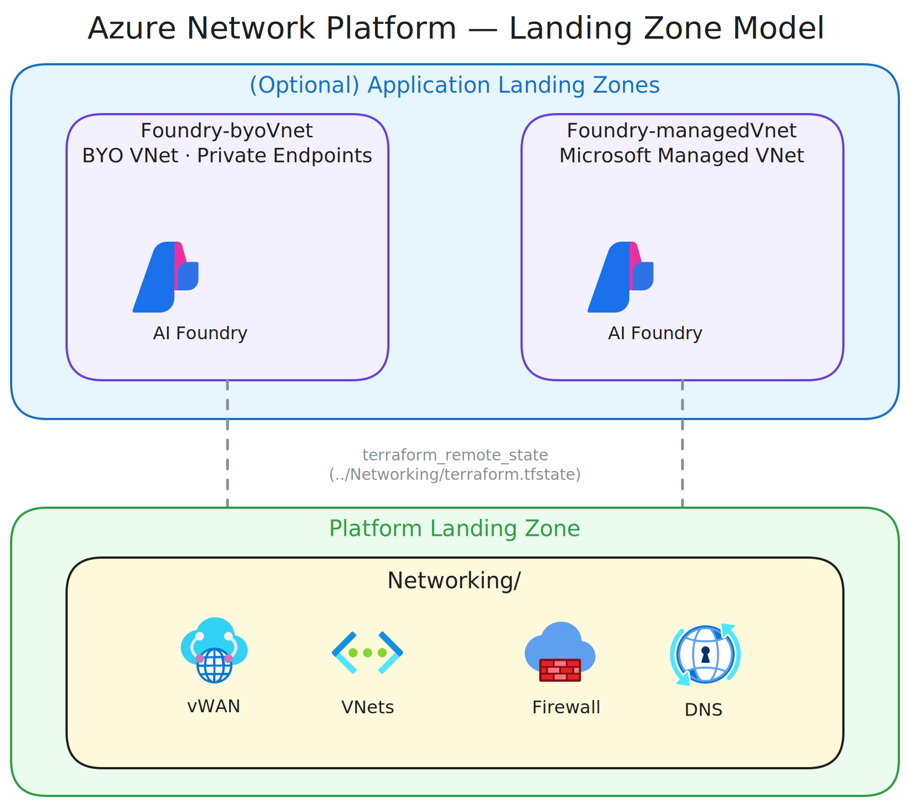

# Azure Network Platform — Landing Zones with Terraform

Terraform for deploying an Azure networking landing zone and optional application landing zones. This repo is for POCs and testing, not production.

## Landing Zone Model

This repo follows a two-tier landing zone pattern:



**Platform Landing Zone**— Shared networking foundation that all workloads depend on.

| Folder        | Layer    | Description                                                             | Docs                             |
| ------------- | -------- | ----------------------------------------------------------------------- | -------------------------------- |
| `Networking/` | Platform | Azure Virtual WAN, hubs, spoke VNets, optional Firewall and Private DNS | [README](./Networking/README.md) |

**Application Landing Zones** — Optional workloads that plug into the platform. Deploy one or more application modules. Each creates its own spoke VNet with a dedicated address range, so there are no CIDR conflicts.

| Folder                    | Layer       | Description                                                   | Docs                                         |
| ------------------------- | ----------- | ------------------------------------------------------------- | -------------------------------------------- |
| `Foundry-byoVnet/`        | Application | AI Foundry with private endpoints in a BYO VNet               | [README](./Foundry-byoVnet/README.md)        |
| `Foundry-managedVnet/`    | Application | AI Foundry with private endpoints in a Microsoft-managed VNet | [README](./Foundry-managedVnet/README.md)    |
| `ContainerApps-byoVnet/`  | Application | Container Apps with ACR in a BYO VNet                         | [README](./ContainerApps-byoVnet/README.md)  |
| `Fabric-byoVnet/`         | Application | Microsoft Fabric with workspace PE (private inbound) + 3 MPEs to shared platform resources (Storage, SQL, KV). Sweden Central. | [README](./Fabric-byoVnet/README.md) |

Future modules will follow the same application landing zone pattern. See the [Adding a New Application Landing Zone](./docs/adding-application-landing-zone.md) guide.

## Prerequisites

- Azure CLI installed and authenticated (`az login`)
- Terraform >= 1.8.3
- `ARM_SUBSCRIPTION_ID` environment variable set (see `setSubscription.ps1`)
- Git

## Getting Started

1. Clone the repo and cd into it.

2. Set your subscription:
   ```powershell
   .\setSubscription.ps1
   ```

3. Deploy the **platform landing zone**:
   ```sh
   cd Networking
   terraform init && terraform apply
   ```

4. (Optional) Deploy an **application landing zone**. Each module is independent:
   ```sh
   cd ../Foundry-byoVnet   # or ../Foundry-managedVnet, ../ContainerApps-byoVnet, or ../Fabric-byoVnet
   terraform init && terraform apply
   ```
   **Note:** Application landing zones require `add_private_dns00 = true` in Networking's tfvars to enable private DNS resolution. Fabric-byoVnet also requires tenant-level Fabric settings configured before deploy (see its README).

See each module's README for details.

## Destroy Order

⚠️ **Destroy application landing zones first, then the platform.**

1. Destroy a Foundry module:
   ```sh
   cd Foundry-byoVnet   # or Foundry-managedVnet
   terraform destroy
   ```

2. **Purge the soft-deleted AI Foundry resource.** The subnet service association link blocks Networking deletion until this is done. Wait ~10 minutes after purge completes.
   - [Purge a deleted resource](https://learn.microsoft.com/en-us/azure/ai-services/recover-purge-resources?tabs=azure-cli#purge-a-deleted-resource)

3. If you destroyed **Fabric-byoVnet**, clear the Networking Key Vault's PE connection slots before re-deploying. Key Vault has a 25-connection limit, and stale MPE connections count against it. See `Fabric-byoVnet/README.md` for the cleanup procedure.

4. Destroy the platform:
   ```sh
   cd ../Networking
   terraform destroy
   ```

See each module's README for details.

## Cost Estimates

This is for demos and labs. Deploy and delete as needed. Don't leave resources running long-term. You can power off VMs and Azure Firewall to save costs when not in use. Use the [Azure Calculator](https://azure.microsoft.com/en-us/pricing/calculator/) for your own estimate.

Rough estimate using Central US, single region:

| Resource                     | Daily (24h) | Monthly (730h) |
| ---------------------------- | ----------- | -------------- |
| Azure vWAN                   | $6          | $182.50        |
| Azure Firewall Premium       | $42         | $1,277.50      |
| VM (Standard_B2s w/ Windows) | $1.19       | $36.21         |

## Development

This repo uses [Squad](https://bradygaster.github.io/squad/) for AI-assisted development. The `.squad/` folder contains agent configuration for that workflow. Squad is not required to deploy any of the environments here; you can ignore that folder entirely.

## Disclaimer

The attached diagrams and code are provided AS IS without warranty of any kind and should not be interpreted as an offer or commitment on the part of Microsoft, and Microsoft cannot guarantee the accuracy of any information presented. MICROSOFT MAKES NO WARRANTIES, EXPRESS OR IMPLIED, IN THIS DIAGRAM(s) CODE SAMPLE(s).
