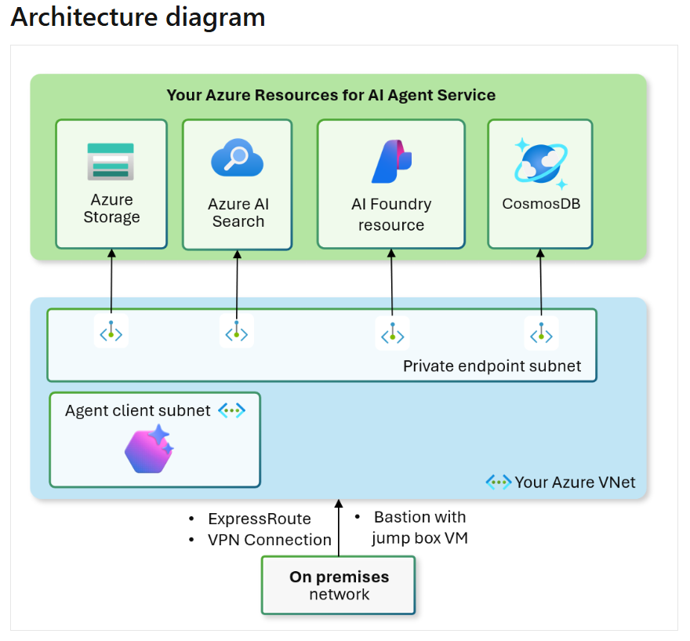

# Networking Foundation and optional demos

## Networking Foundation

The Terraform deployment in the Networking folder will deploy an Azure Virtual WAN environment that can be used as the foundation for demos (not production environments). There are conditional variables to add any of the following:

- a secondary region w/ vWAN
- Azure Firewall in either or both regions
- Azure Private DNS in either or both regions (Private DNS Zones and Private Resolver)
  - DNS Security Policy logging to a Log Analytics Workspace
- Virtual network for a secure private Foundry deployment (vNet only in this deployment)
- Azure VPN Gateway in either or both regions

### Example

### Pre-reqs

Here are the pre-reqs for running this in your environment:

- Update/Set Azure Subscription ID variable
- Git
- Terraform

Set your Azure Subscription ID as an environment variable in Windows for Terraform deployments. The alternative is hardcoding the sub ID in your Terraform config file. I've provided a CLI example in the setSubscription.ps1 script to pull your sub ID and set as an environment variable.

Install Git and Terraform locally. Git clone the repo to your machine. CD into the cloned folder and run terraform init to install the required providers.

### Cost

This is meant for demo/lab purposes. One of the reasons to use IaC for your lab is to easily deploy and delete. I wouldn't leave any of these configurations running for an extended period of time. With that said, you can power off the VM and Azure Firewall to save costs when not in use. You can use the Azure Calculator to estimate cost.

Below is a rough estimate using Central US:

#### One day (24 hours) w/ single region

- Azure vWAN - $6
- Azure Firewall Premium - $42
- VPN Gateway scale unit - $8.66
- VM (Standard_B2s w/ Windows) - $1.19
- Total cost - $57.86

#### One month (730 hours) w/ single region

- Azure vWAN - $182.50
- Azure Firewall Premium - $1,277.50
- VPN Gateway scale unit - $263.53
- VM (Standard_B2s) - $36.21
- Total cost - $1,759.96

## Private (BYO VNet) Foundry with AI Agent Service (optional)

The Terraform deployment in the Foundry-byoVnet folder will deploy Foundry with AI Agent Service and private endpoints. I modified the sample template below to be dependent on the Networking Foundation template. Apply the Networking Foundation folder first and then apply this folder to complete the build. Foundry, and required resources, will be deployed in your primary region only. Ensure you select a region that supports AI Foundry and where you have quota.

- Private Foundry TF example with AI Agent Service - https://github.com/azure-ai-foundry/foundry-samples/tree/main/infrastructure/infrastructure-setup-terraform/15b-private-network-standard-agent-setup-byovnet

The template above follows the documented architecture (below) for deploying AI Foundry Standard Setup with private networking (BYO VNet).

- Foundry Standard Setup with private networking - https://learn.microsoft.com/en-us/azure/ai-foundry/agents/how-to/virtual-networks

